# ⛏ 데이터마이닝

> 해당 문서는 여러 강의에서 다루었던 내용을 입맛대로 조합하여 작성하였으며, 따라서 대학에서 강의하는 일반적인 커리큘럼 및 데이터마이닝 교재와 차이가 있을 수 있습니다

## 공통 개념 및 용어

- **벡터 (Vector)**  
    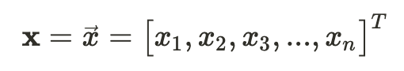
- **평균과 분산 (Mean and variance)**  
    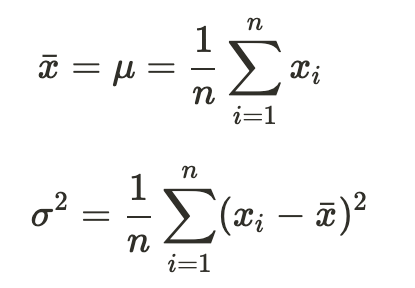  
- **오차 (Error)**
  - **평균 제곱근 오차 (RMSE, Root-Mean-Square Error)**  
      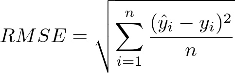
    - 위 수식에서 ŷ 은 예측 값(predicted), y는 실제 값(actual)을 의미한다

### ✔️ 거리/유사도 (Distance/Similarity)

- 거리 함수(**metric** function)의 만족 조건
  1. **Positive definiteness** (구분 불가능한 점의 동일성): `d(i, j) if i ≠ j, and d(i, i) = 0`
  2. **Symmetry** (대칭성): `d(i,j) = d(j,i)`
  3. **Triangle Inequality** (삼각 부등식): `d(i,j) ≤ d(i,k) + d(k,j)`
  
- **유클리디언 거리 (Euclidean distance)**  
    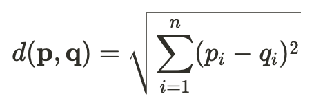
  
- **맨해튼 거리 (Manhattan distance)**  
    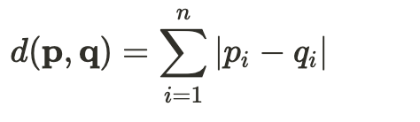
  
- **민코프스키 거리 (Minkowski distance)**  
    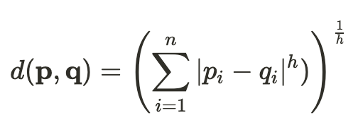
  - 맨해튼 거리와 유클리디언 거리는 민코프스키 거리의 특별한 유형이다 (각각 `h=1`, `h=2`)
  
- **코사인 유사도 (Cosine Similarity)**  
    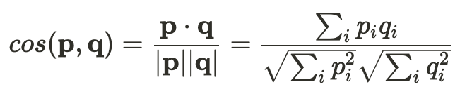

  - 두 벡터가 이루는 각도를 통해 유사도(거리) 측정
  - 각도가 적을 수록 유사도가 높으며, 각이 클수록 유사도가 작음
  - 벡터의 크기는 값에 아무런 영향을 미치지 않음

- **Jaccard Similarity (자카드 유사도)**  
    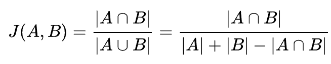

  - 자카드 계수(Jaccard coefficient) 또는 자카드 지수(Jaccard index)라고도 함
  - 0과 1 사이의 값을 가지며, 두 집합이 동일하면 1의 값을 가지고, 공통의 원소가 하나도 없으면 0의 값을 가짐  

## 분류 (Classification)

### ✔️ Classification 과 Prediction

  - **Classification**: Discrete/nominal한 결과를 출력 (클래스의 수가 정해져 있다). 맞거나 틀리거나 둘 중 하나의 결과만이 있음
  - **Prediction**: 연속적인(continuous) 결과를 출력. 얼마나 틀렸는지(오차, error)도 알 수 있음

### ✔️ Supervised vs Unsupervised Learning

  - **Supervised**: 학습 데이터에 대응하는 라벨이 존재하며, 라벨과 함께 학습을 진행 (e.g., Classification)
  - **Unsupervised**: 학습 데이터의 라벨이 존재하지 않음 (e.g., Clustering)

### ✔️ Confusion Matrix와 성능 평가 지표

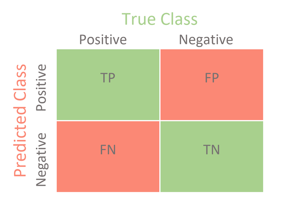 

- **Recall**: `TP / (TP+FN)`
  - 실제 True인 것 중에서 모델이 True라고 예측한 것의 비율
- **Precision**: `TP / (TP+FP)`
  - 모델이 True라고 분류한 것 중에서 실제 True인 것의 비율
- **Accuracy**: `(TP+TN)/(TP+FN+FP+TN)`
  - 모델이 실제로 맞춘 것의 비율

### ✔️ 의사결정트리 (Decision Tree)

  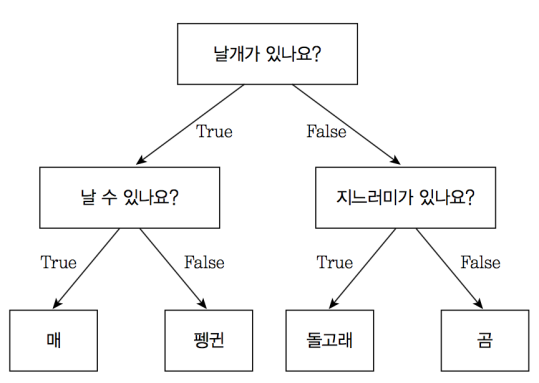

- Non-terminal 노드에는 조건이 위치하며, Terminal 노드에는 label이 위치

- **트리의 생성**:
  - 분류 작업에 의사결정트리를 사용하기 위해서는 학습 데이터를 바탕으로 트리 생성 작업이 필요
  - 데이터와 라벨의 수가 적고 명료하다면 직관적으로 조건을 지정해 줄 수도 있지만, 그렇지 않으면 어떻게 **조건(condition)**을 생성하는지가 문제가 된다.
  - Heuristic 방법이나 statistical 방법을 이용하여 조건을 정하게 됨

- **Information gain**
  - 통계적 방법으로 information gain이 증가하는 방향으로 조건(A)을 선택  
  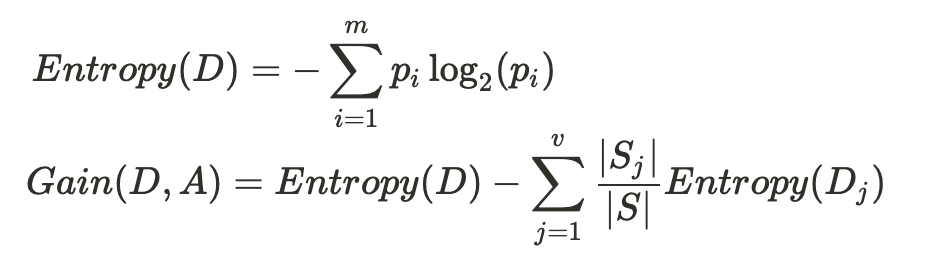

  - Entropy대신 Gini index가 사용되기도 함  
  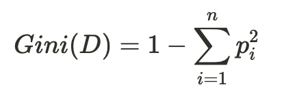

### ✔️ 베이즈 정리 (Bayes' Theorm)
  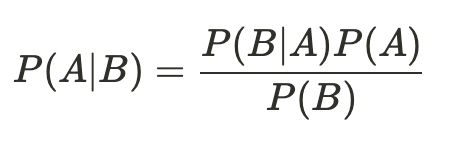

- P(A), P(B), P(B|A)를 알 때 P(A|B)를 구할 수 있음
- 용어 정리
  - P(A): 사전 확률(prior). 사건 B가 발생하기 전에 가지고 있던 사건 A의 확률
  - P(A|B): 사후 확률(posterior). 사건 B가 발생한 후 갱신된 사건 A의 확률
  - P(B|A): 가능도, 우도(likelihood). 사건 A가 발생한 경우 사건 B의 확률
  - P(B): 관찰 값(evidence). 확률의 크기 조정

### ✔️ 나이브 베이즈 분류 (Naïve Bayes Classification)

  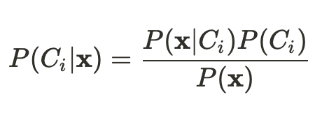

- 베이즈 정리를 이용한 분류법
- x는 속성 벡터이고, Ci 는 임의의 클래스이다.
- 분류기 생성 과정에서 학습 데이터의 P(x), P(x|Ci), P(Ci)를 미리 계산해둔다.
- 이후 새로운 속성 벡터 x'을 가진 데이터가 들어왔을 때, 계산된 데이터를 바탕으로 P(Ci|x')의 근사치를 계산할 수 있게 된다.

### ✔️ 선형 회귀 (Linear Regression)

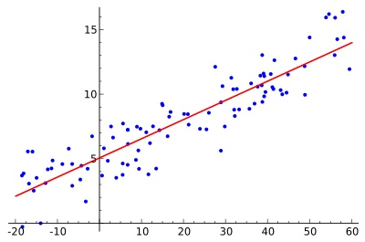

- 두 데이터(독립 변수 X, 종속 변수 Y) 간의 선형 상관관계를 모델링 하는 기법
- 단순 선형 회귀와 **최소제곱법 (least squares)**
  - eq(1)은 단순 선형 회귀 모델을, eq(2)와 eq(3)은 최소제곱법을 의미
  - 최소제곱법: 점들로부터 거리들의 제곱의 합이 최소가 되게 하는 선을 구하는 모델  
  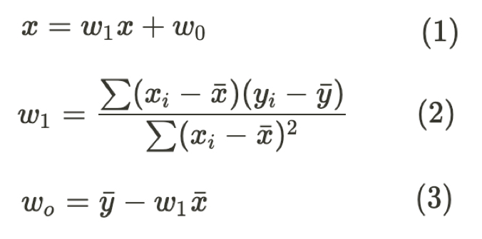

### ✔️ 서포트 벡터 머신 (Support Vector Machine, SVM)

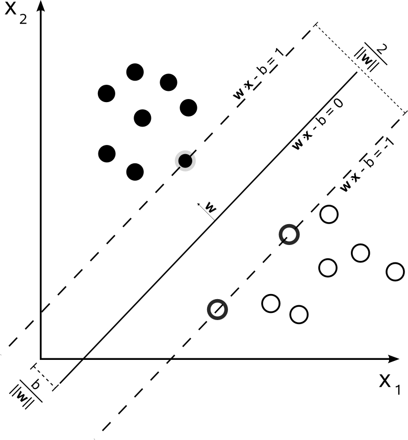

- 벡터 공간에서 두 클래스를 분류하는 선(2차원) 혹은 hyperplane(3차원 이상)을 찾는 모델
- 존재할 수 있는 여러 분류 경계면 중 **마진(margin)을 최대화** 하는 것을 찾아냄
  - 위 그림에서 가운데 선이 이에 해당

  
### ✔️ *k*-최근접 이웃 알고리즘 (*k*-Nearest Neighbor Algorithm, k-NN)

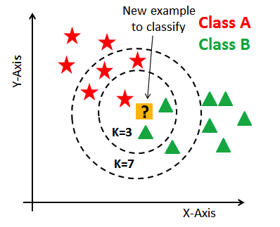

- 새로운 데이터가 주어졌을 때, 기존 데이터 가운데 가장 가까운 `k`개 이웃의 정보로 새로운 데이터를 예측하는 알고리즘
- `k`의 크기가 작다면 오버 피팅의 가능성이 있으며, `k`의 크기가 너무 크면 과하게 정규화 되는 경향이 있음
- 학습시키는 과정이 따로 없거나 제한적이며, 실행 시점에 많은 계산이 수행됨 (lazy evaluation)

## 군집화 (Clustering)

### ✔️ 클러스터링(군집화)이란

- 비슷한 개체끼리 같은 군집으로, 다른 개체는 다른 군집으로 묶는 것
- 정량적 목표
  - 군집 간 분산(inter-cluster variance) 최대화
  - 군집 내 분산(inner-cluster variance) 최소화

### ✔️ K-평균 군집화 (K-means Clustering)

- `k`가 주어졌을 때, k개의 클러스터로 데이터를 나누는 알고리즘  
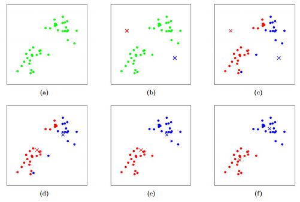

- 알고리즘:
  1. 임의의 점 k개를 centroids(클러스터의 중심)로 설정한다.
  2. 모든 데이터들을 순회하여 가장 가까운 centroids가 속한 군집에 할당한다.
  3. 새롭게 구성된 군집의 centroids를 다시 계산한다.
  4. Centroids가 바뀌지 않을 때까지 2~3을 반복한다.
- 시간 복잡도: O(tkn) (t=이터레이션 수, k=클러스터 수, n=데이터 수)
- 평균 계산이 가능한 상황에서만 사용이 가능하며, k의 지정이 필수적이라는 한계 존재

### ✔️ 계층적 군집화 (Hierachical Clustering)

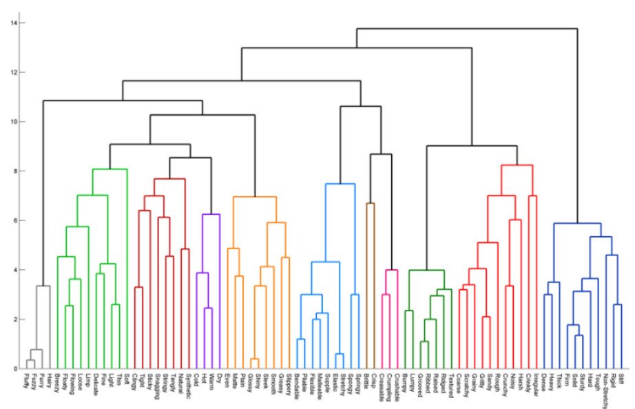

- 여러 클러스터 중에서 가장 유사도가 높은(거리가 가까운) 클러스터끼리 병합해가며 클러스터 수를 줄이는 모델 
- k-means와 달리 사전에 클러스터 수를 지정하지 않아도 됨  
- 시간 복잡도: O(n2 log n); priority queue를 이용하여 거리 계산 시

### ✔️ DBSCAN (Density-Based Spatial Clustering of Applications with Noise)

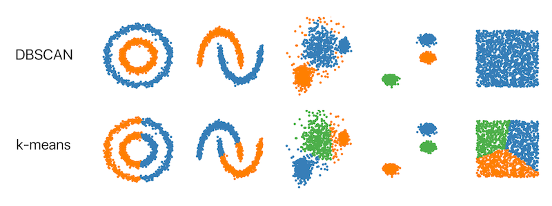

- k-means나 계층적 군집화는 주로 클러스터 간의 거리를 이용하여 클러스터링을 진행함에 반해, DBSCAN은 밀도 기반으로 클러스터링을 수행

## 데이터 전처리 (Data Preprocessing)

### ✔️ 정규화 (Normalization)

- Min-max normalization  
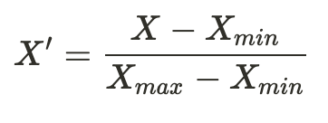

- Z-score(standard) normalization  
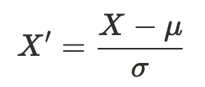

### ✔️ 상관 분석 (Correlation Analysis)

- 두 변수 간에 어떤 비선형적 관계를 갖고 있는지를 분석하는 방법  
  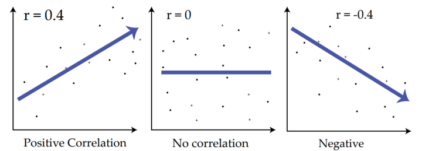

- 피어슨 상관 계수 (Pearson Correlation Coefficient, PCC)  
  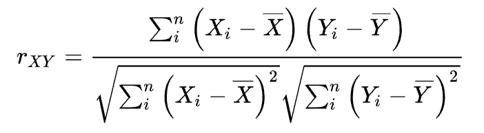

- 카이제곱 분석 (Chi-squared test, χ2-test)  
  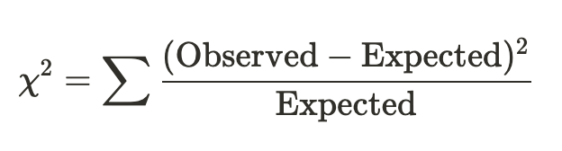

  - 값이 클 수록 두 변수간에 상관 관계가 크다
  
### ✔️ Curse of dimensionality
- 차원(dimension)이 커지면 데이터 분포가 희소(sparse)해지며, 희소한 데이터는 점들 간의 밀도(density)와 거리(distance)의 의미를 희석시켜 분석을 어렵게 만듦
- 데이터 전처리 과정 중에 **차원 축소(dimensionality reduction)** 를 수행하여 데이터를 더 처리하기 용이하게 만들 수 있음

### ✔️ PCA (Principal Component Analysis, 주성분 분석)
  - 차원 축소를 위한 대표적인 알고리즘
  - 분산을 최대한 보존하면서 서로 직교하는 새로운 축을 찾아 고차원 공간의 표본들을 선형 연관성이 없는 저차원 공간으로 변환하는 기법
  - 방법
      1. 행렬 X의 공분산 행렬 Σ을 구한다
      2. Σ의 고유 벡터(eigenvector)와 고유 값(eigenvalue) 페어들을 구한다 (다수의 고유 벡터와 고유 값이 있을 수 있다)
      3. 고유 값이 큰 순서대로 고유 벡터를 정렬하면 중요한 순서대로 주 성분을 구할 수 있다 (reduced dimension matrix)
  - 공분산 행렬 (Σ)  
    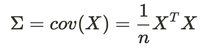
  - 고유 벡터와 고유 값 (eigenvector and eigenvalue)  
    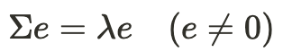
    - e가 고유 벡터, λ가 고유 값이다

## 링크 분석 (Link Analysis)

### ✔️ 페이지 랭크 (PageRank)

- 초창기 구글의 검색 알고리즘
- 더 중요한 페이지는 더 많은 다른 사이트로부터 링크를 받는다는 관찰에 기초
- 웹 페이지 A의 PageRank는 자신을 인용(cite) 하고 있는 다른 페이지들의 정규화된 PageRank의 합에 비례  
  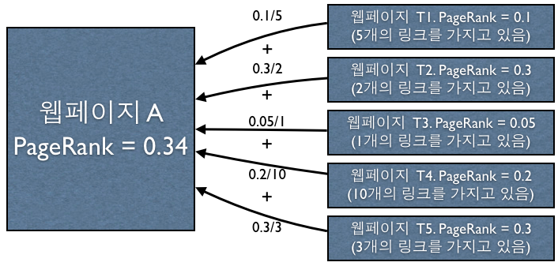
- 영향력 있는 페이지가 인용할수록 PageRank가 올라간다 (아래 그림에서 C)  
  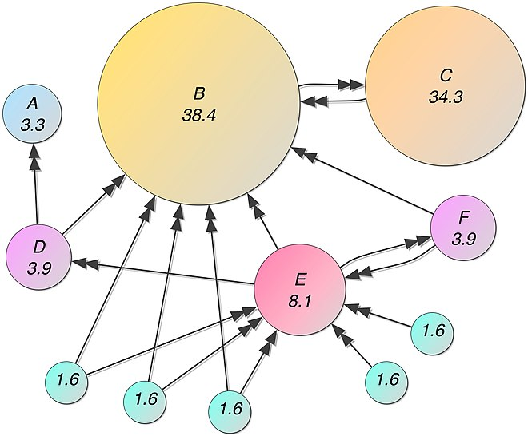
- Damping factor(`d`)를 포함한 정확한 수식은 아래와 같으며, PageRank가 수렴할 때까지 iteration을 반복하며 계산할 수 있음  
  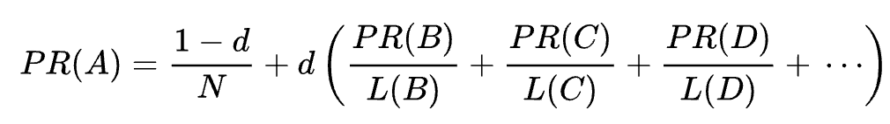
  - Damping factor: 어떤 마구잡이로 웹서핑을 하는 사람이 그 페이지에 만족을 못 하고 다른 페이지로 가는 링크를 클릭할 확률. 논문에서는 0.85로 설정

### ✔️ HITS (hyperlink-induced topic search)

- Hubs and Authorities
  - Authorities: 인용을 잘 **받는** 페이지
  - Hubs: 인용을 잘 **하는** 페이지
- PageRank와 마찬가지로 수렴할 때까지 iteration을 반복하며 계산  
  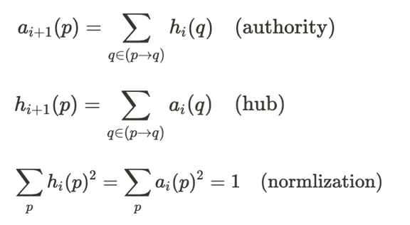

---

### 참고자료

- 한양대학교 데이터사이언스 수업 강의자료, 김상욱 교수 (ITE4005)
  - 교재 - Data mining: concepts and techniques, J. Han 외
- KAIST 빅데이터분석특강 수업 강의자료, 황의종 교수 (EE412)
  - 교재 - Mining of Massive Datasets (2nd edition), J. Leskove 외
- https://ko.wikipedia.org/
- https://ratsgo.github.io/
- https://datascienceschool.net/
- https://stanford.edu/~cpiech/cs221/handouts/kmeans.html
- https://angeloyeo.github.io/2019/07/27/PCA.html

### 이미지 출처

- Confusion Matrix: https://towardsdatascience.com/confusion-matrix-for-your-multi-class-machine-learning-model-ff9aa3bf7826
- 의사결정트리: [https://tensorflow.blog/파이썬-머신러닝/2-3-5-결정-트리/](https://tensorflow.blog/파이썬-머신러닝/2-3-5-결정-트리/)
- 선형회귀: https://ccibomb.tistory.com/993?category=863544
- 서포트 벡터 머신: [https://ko.wikipedia.org/wiki/서포트\_벡터\_머신](https://ko.wikipedia.org/wiki/서포트_벡터_머신)
- k-최근접 이웃 알고리즘: https://www.kdnuggets.com/2020/11/most-popular-distance-metrics-knn.html
- k-평균 군집화: https://stanford.edu/~cpiech/cs221/handouts/kmeans.html
- 계층적 군집화: https://ratsgo.github.io/machine%20learning/2017/04/18/HC/
- DBSCAN: https://www.kdnuggets.com/2020/04/dbscan-clustering-algorithm-machine-learning.html
- PageRank: https://sungmooncho.com/2012/08/26/pagerank/
