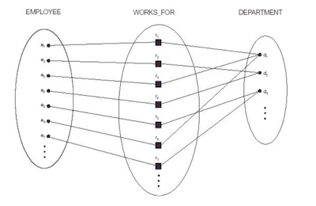
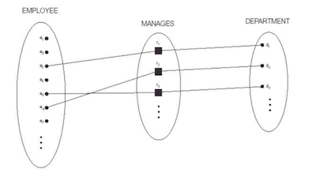
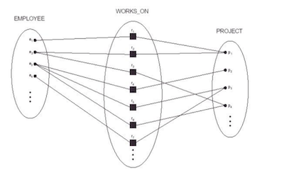
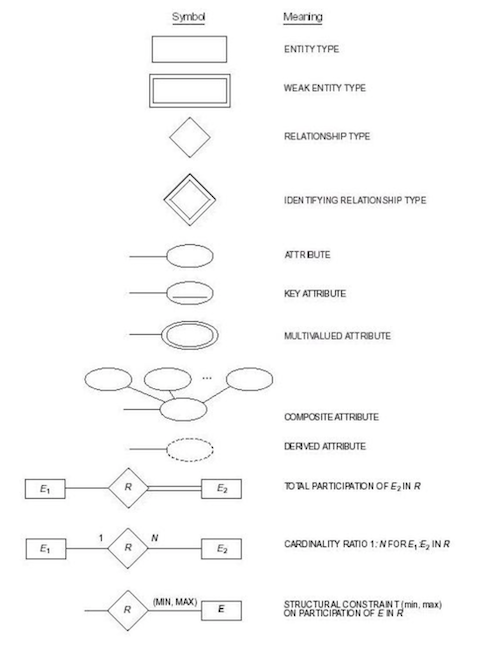
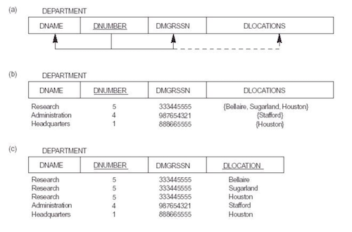
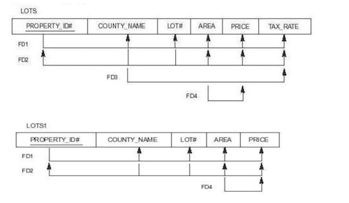
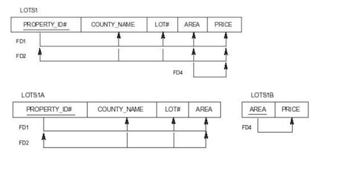
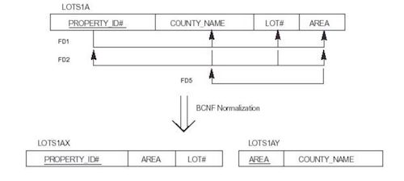

# 데이터베이스

### ✔️ 데이터 모델의 분류

- 물리적 데이터 모델
    - 데이터가 컴퓨터 내에서 물리적으로 어떻게 저장되는가에 관한 세부 사항을 명시하는 방식을 제공
    - 실질적인 데이터 저장 방식과 밀접한 하위 수준의 데이터 모델
    - 레코드의 형식, 순서, 접근 경로 등의 정보를 제공
- 개념적 데이터 모델
    - 데이터를 개념적으로 표현하는 방식을 제공
    - 일반 사용자들이 인식하는 방식과 밀접한 상위 수준의 데이터 모델
    - 예: 개체 관계 모델(entity-relationship model)
- 표현(구현) 데이터 모델
    - 물리적 데이터 모델과 개념적 데이터 모델의 중간 수준에 존재
    - 일반 사용자들이 이해할 수 있는 방식으로 데이터를 표현하면서도 실질적 데이터 저장 방식과도 잘대응되는 방식을 제공
    - 대부분의 상용 DBMS에서 채택함
    - 예: 관계 모델(relational model), 네트워크 모델(network model), 계층 모델(hierarchical model)

### ✔️ 3단계 스키마 아키텍처

- 내부 단계 (internal level)
    - 물리적 저장 구조 기술
- 개념 단계 (conceptual level)
    - 상위 수준의 데이터 모델 혹은 구현 데이터 모델을 이용하여 논리적 구조를 표현
    - 엔티니, 데이터 타입, 곤계, 사용자 연산, 제약 조건 등의 형태로 표현
- 외부 단계 (external level) or 뷰 단계 (view level)
    - 특정 사용자 그룹이 관심을 갖는 부분만을 기술
- 💡 데이터 독립성
    - 하위 단계의 스키마를 변경하는 경우에도 상위 단계의 스키마가 영향을 받지 않는다

### ✔️ DBMS 언어

- DDL (데이터 정의어; Data Definition Language)
    - 외부 스키마, 개념 스키마, 내부 스키마를 정의하는데 사용
    - CREATE, ALTER, DROP
- DML (데이터 조작어; Data Manipulation Language)
    - 사용자 데이터를 검색, 삽입, 삭제, 수정하는데 사용
    - SELECT, INSERT, DELETE, UPDATE
- DCL (데이터 제어어; Data Control Language)
    - COMMIT, ROLLBACK, GRANT, REVOKE

### ✔️ ER 모델

- 개체와 애트리뷰트
    - 개체 (Entity): 실세계에서 독립적으로 존재하는 실체
    - 애트리뷰트 (Attribute): 각 개체를 설명해 주는 고유의 특성
- 애트리뷰트의 유형
    - 단순(원자) 애트리뷰트 - 복합(composed) 애트리뷰트
    - 단일 값 애트리뷰트 - 다치(집합, multi-valued) 애트리뷰트
    - 저장된 애트리뷰트 - 유도된(derived) 애트리뷰트
- 키 애트리뷰트
    - 동일한 개체 타입에 속하는 각 객체를 **유일하게 식별**
    - 각 개체마다 서로 다른 값을 갖도록 제한된 애트리뷰트
    - 복합 애트리뷰트가 키 형성 가능
    - 하나의 개체타입이 두 개 이상의 키를 가질 수 있음
- 관계의 기본 개념
    - 관계 인스턴스: 개체 타입에 속하는 개체들간의 연관성
    - 관계 타입: 동일한 형태의 관계 인스턴스의 집합을 기술한 것
    
- **카디널리티 비율**
    - 1:N
    
    
    
    - 1:1
    
    
    
    - N:M
    
    
    
- **약한 개체 타입**
    - 자신의 키 애트리뷰트가 없는 개체 타입 (오너를 통해 식별)
    - 부분 키 (Partial Key): 동일한 소유자 객체와 연관된 약한 개체들을 구분하는데 사용되는 애트리뷰트들의 집합 (외래키와 같이 묶으면 고유하게 식별이 됨)
    
- ER 다이어그램 표기법




### ✔️ 관계 모델

- 용어
    - **도메인**: 더 이상 나눌 수 없는 원자 값들의 집합
    - **애트리뷰트**: 특정 릴레이션에서 도메인이 가지는 역할을 나타내는 이름
    - **릴레이션 스키마**: 릴레이션 이름 R과 애트리뷰트 Ai들의 집합
    - **릴레이션의 차수**: 릴레이션이 포함하는 애트리뷰트의 수
    - **릴레이션의 투플**: 순서화된 값들의 집합
- 관계 모델의 키
    - **수퍼키:** 임의의 서로 다른 두 투플에 대해 같은 값을 갖지 않는 *애트리뷰트 집합*
    - **후보키**: 최소 수퍼키; 수퍼키를 구성하는 어느 한 애트리뷰트라도 제외되면 더 이상 수퍼키가 될 수 없는 것
    - **기본키**: 사용자에 의해 선택된 후보키 중 하나
    - 대체키: 후보키에서 기본키를 제외한 것
    - 키 제약 조건: 릴레이션에는 후보키에 해당되는 애트리뷰트들이 존재해야 함
- 무결성 제약 조건
    - **개체 무결성**: 릴레이션에서 기본키에 해당하는 애트리뷰트들은 NULL 값을 가질 수 없음
    - **참조 무결성**: **외래키**의 값은 참조하는 릴레이션의 기본키와 일치하거나 NULL 값을 가져야함
    - **도메인 무결성**: 애트리뷰트 값은 도메인에 속하는 값이어야 함

### ✔️ 관계 대수

- SELECT 연산
    - <code>σ<sub>c</sub>(R)</code>
    - 조건 c를 만족하는 투플들의 집합을 선택
- PROJECT 연산
    - <code>π<sub>L</sub>(R)</code>
    - 리스트 L에 명시된 애트리뷰트들만 선택
- 집합 연산
    - `∪, ∩, -, ×`
    - 이 연산들에 대해 애트리뷰트들의 갯수가 같고 도메인이 호환성을 가져야 함
    - 카티션 프로덕트 (`×`)
        - {a, b} x {1, 2, 3}
        = {(a, 1), (a, 2), (a, 3), (b, 1), (b,2), (b, 3)}
        - 조인 연산과 같은 결과를 낼 수 있음
        - 예시
            - ALL_PRODUCT ← DEPARTMENT × EMPLOYEE
            - DEPT_MGR ← σ<sub>MGRSSN=SSN</sub> ALL_PRODUCT
            - RESULT ← π<sub>DNAME,FNAME,LNAME</sub>(DEPT_MGR)
- 조인 연산
    - 예시
        - DEPT_MGR ← DEPARTMENT ×<sub>MGRSSN=SSN</sub> EMPLOYEE
        - RESULT ← π<sub>DNAME,FNAME,LNAME</sub>(DEPT_MGR)
    - 세타 조인 (THETA JOIN): 두 테이블에 대한 카티션 프로덕트 연산 후, SELECT 연산을 적용하는 것과 동일한 효과
    - 동등 조인 (EQUI JOIN): 조인 조건인 c에서 사용되는 연산자가 동등 비교 연산자인 경우
    - 자연 조인 (NATURAL JOIN, `*`): 조인의 결과에서 나타나는 중복되는 조인 애트리뷰들 중 하나를 최종 결과에서 삭제
        - ex) EMPLOYEE의 이름과 그가 일하는 DEPARTMENT의 이름을 검색하라
        - TMP ← EMPLOYEE * DEPARTMENT
        - RESULT ← π<sub>FNAME,LNAME,DNAME</sub>(TMP)

### ✔️ SQL

- SQL의 종류
    - DML (Data Manipulation Language): SELECT, INSERT, UPDATE, DELETE
    - DDL (Data Definition Language): CREATE, ALTER, DROP, RENAME 등
    - DCL (Data Control Language): GRANT, REVOKE 등
- 테이블 생성

```sql
CREATE TABLE DEPARTMENT(
	DNAME VARCHAR NOT NULL,
	DNUMBER INTEGER NOT NULL,
	MGRSSN CHAR(9),
	MGRSTARTDATE CHAR(9),
	PRIMARY KEY (DNUMBER)
	UNIQUE (DNAME)
	FOREIGN KEY (MGRSSN) REFERENCES EMPLOYEE(SSN) ON DELETE CASCADE
);
```

- 참조 무결성 위반시
    - 시점: `ON DELETE`, `ON UPDATE`
    - 동작: `SET NULL`, `CASCADE`, `SET DEFAULT`
- 테이블 제거

```sql
    DROP TABLE DEPENDENT CASCADE; # 모든 제약조건과 뷰를 함께 제거
    DROP TABLE DEPENDENT RESTRICT; # 안전 제거
```

- 테이블 변경

```sql
ALTER TABLE COMPANY.EMPLOYEE ADD JOB VARCHAR(12);
ALTER TABLE COMPANY.EMPLOYEE DROP ADDRESS CASCADE;
ALTER TABLE COMPANY.EMPLOYEE ALTER MGRSSN DROP DEFAULT;
ALTER TABLE COMPANY.EMPLOYEE ALTER MGRSSN SET DEFAULT "333445555";
ALTER TABLE COMPANY.EMPLOYEE DROP CONSTRAINT EMPSUPERFK CASCADE;
```

- 질의

```sql
    SELECT <속성 목록>
    FROM <테이블 목록>
    [WHERE <조건> [AND|OR <조건>]*]
    [GROUP BY <집단화 애트리뷰트>]
    [HAVING <집단 조건>]
    [ORDER BY (<애트리뷰트> DESC|ASC)+]
```

- 중첩 질의 (Nested query)
    - 모든 중첩 질의는 중첩되지 않은 질의로 변환이 가능하다

```sql
SELECT DISTINCT PNUMBER
FROM PROJECT
WHERE PNUMBER IN (SELECT PNUMBER
                  FROM PROJECT, DEPARTMENT, EMPLOYEE
                  WHERE DNUM=DNUMBER AND
                  MGRSSN=SSN AND LNAME='Smith')
```

- 중첩 질의에서의 집합 비교
    - `IN`: 집합에 포함되어 있는지
    - `ANY`: 집합 내의 어떤 한 값과 연산 결과가 참인지 (`=` 외에도 `>,<,<=,=>, <>` 사용 가능)
    - `ALL`: 집합 내의 모든 값과 연산 결과가 참인지
- EXISTS 함수와 UNIQUE 함수
    - `EXISTS`: 최소 하나의 투플이 존재하면 참
    - `NOT EXISTS`: 하나의 투플도 존재하지 않아야 참
    - `UNIQUE`: 중복된 투플이 존재하지 않아야 참
- 삽입

```sql
    INSERT INTO EMPLOYEE
    VALUES ('Richard', 'K', '30-DEC-52', 'TX', 'M');
```

- 삭제

```sql
    DELETE FROM EMPLOYEE WHERE LNAME='Brown';
```

- 갱신

```sql
    UPDATE EMPLOYEE SET DNUM=5 WHERE PNUMBER=10;
```

### ✔️ 정규화

- 이상의 종류
    - 삽입 이상 (Insertion Anomaly): ex) 사원이 없는 새 부서 삽입 불가
    - 삭제 이상 (Deletion Anomaly): ex) 사원이 모두 사라지면 부서도 사라짐
    - 갱신 이상 (Update Anomaly): ex) 부서의 관리자 변경시 수많은 투플에 대해 반영 필요
- **1NF (제 1 정규형)**
    - 각 애트리뷰트 도메인이 오직 원자값만을 포함
    - 투플의 각 애트리뷰트 값은 해당 도메인에 속하는 한 값만을 가짐



- **2NF (제 2 정규형)**
    - 모든 비주요 애트리뷰트가 모든 후보키에 완전 함수적 종속
        - 비주요 애트리뷰트: 후보키 애트리뷰트 중 하나도 아닌 것
        - 완전 함수적 종속성(full functional dependency): X → Y에서 X의 어떤 애트리뷰트라도 제거하면 이 함수적 종속성 X → Y 가 더이상 성립하지 않는 경우
        - 부분 함수적 종속성(partial functional dependency): X → Y에서 X의 어떤 애트리뷰트라도 제거하더라도 이 함수적 종속성 X → Y 가 더이상 성립하는 경우



- **3NF (제 3 정규형)**
    - 테이블 스키마 R에 존재하는 모든 함수적 종속성 X→A에 대하여 X가 R의 수퍼키이거나 A가 R의 주요 애트리뷰트



- **BCNF (Boyce-Codd 정규형)**
    - 테이블 스키마 R에 존재하는 모든 함수적 종속성 X→A에 대하여 X가 R의 수퍼키



### ✔️ 트랜잭션 (Transaction)

- ACID
    - **Atomicity(원자성)**: all or nothing의 상태만 존재해야 함
    - **Consistency(일관성)**: 트랜잭션이 실행을 성공적으로 완료하면 언제나 일관성 있는 데이터베이스 상태로 유지해야 함
    - **Isolation(격리성)**: 트랜잭션을 수행 시 다른 트랜잭션의 연산 작업이 끼어들지 못하도록 보장하는 것
    - **Durability(지속성)**: 성공적으로 수행된 트랜잭션은 영원히 반영되어야 함
- Concurrent execution에서 발생할 수 있는 문제
    - **Lost Update Problem**
        - 두 트랜잭션이 같은 리소스에 교차하며 read, write를 진행하는 경우 발생하는 문제
    - Uncommited Dependency Problem
        - 트랜잭션이 rollback 되기 전에 다른 트랜잭션에서 변경된 상태의 리소스를 참조하는 경우 발생하는 문제
    - Inconsistant Anaylysis Problem
        - 여러 값들을 읽는데 쓰기는 동시에 하지 않아서 생기는 문제
        - ex) `x+y+z` vs `(x+y)+z`