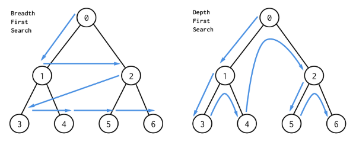
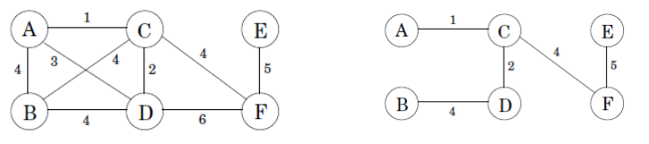

# ⏳ 알고리즘

### ✔️ 점근 표기법 (Asymptotic notation)


| 표기법           | 의미      |  수학적 의미              |
|-----------------|-----------|-------------------|
| f(n) = O(g(n))  | upper bound | f(n) <= cg(n) + d |
| f(n) = Ω(g(n))  | lower bound | f(n) >= cg(n) + d |
| f(n) = Θ(g(n))  | tight bound | ag(n) + b <= f(n) <= cg(n) + d |
| f(n) = o(g(n))  |  | f(n) < cg(n) + d |
| f(n) = ω(g(n))  |  | f(n) > cg(n) + d |


### ✔️ 분할 정복 (Divide and Conquer)

- 큰 문제를 작은 문제로 분할하여 문제를 해결하는 방법이나 알고리즘
- 대표적으로 이진 탐색(Binary Search), 행렬 곱셈 (Matrix multiplication), 합병 정렬(Merge Sort), 퀵 정렬(Quick Sort) 등이 분할 정복을 이용한 알고리즘임
    - 이진 탐색의 시간복잡도를 재귀적으로 표현하면 T(n) = T(n/2) + Θ(1)
    - Strassen's 방법을 사용하면 T(n) = 7T(n/2) + Θ(n<sup>2</sup>)의 시간 복잡도로 행렬 곱셈 구현 가능
- **마스터 정리(Masters Theorem)**
    - 재귀 관계식으로 표현한 알고리즘의 동작 시간을 점근적으로 계산하여 간단하게 계산하는 방법


### ✔️ 정렬

- **버블 정렬 (Bubble Sort)**
    - 서로 인접한 2개의 레코드를 비교하여 크기가 순서대로 되어 있지 않으면 swap
    - 1회전시 d[1]와 d[2], d[3]와 d[4], ... d[n-1]와 d[n]를 비교한다
    - k회전시 n-k+1번 까지만 비교를 수행하면 된다
    - O(n<sup>2</sup>)
- **선택 정렬 (Selection Sort)**
    - 해당 순서에 원소를 넣을 위치는 이미 정해져 있고, 어떤 원소를 넣을지 선택하는 알고리즘
    - k회전시 k ~ n번째 레코드들을 보아야 한다.
    - O(n<sup>2</sup>)
- **삽입 정렬 (Insertion Sort)**
    - 2번째 레코드부터 앞의 레코드들을 보며 자신이 위치해야 할 곳으로 삽입 하면서 정렬한다
    - k번째 레코드는 1~(k-1)번째 레코드들과 비교해야한다
    - O(n<sup>2</sup>)
- **합병 정렬 (Merge Sort)**
    - 대표적인 분할 정복(divide and conquer) 방법
    - 원소의 크기가 1이 될 때까지 두개로 분할한 후, 2개의 리스트의 값들을 처음부터 하나씩 비교하여 두 개의 리스트의 값 중에서 더 작은 값을 새로운 리스트(sorted)로 옮긴다.
    - O(n<sup>2</sup>)
    - ❌ In-place algorithm(제자리 알고리즘)이 아니다; `O(n)`만큼의 새로운 공간 요구
- **힙 정렬 (Heap Sort)**
    - 배열의 요소로 max heap을 build 하고, 하나씩 요소를 꺼내서 배열의 뒤부터 저장하면 된다. (별도 공간 불필요)
    - O(nlog n)
    - ✅ In-place algorithm임
- **퀵 정렬 (Quick Sort)**
    - 개념
        - 리스트 안의 한 요소를 고르고, 이를 피벗(pivot)이라 한다. 피벗을 기준으로 작은 요소들은 피벗 왼쪽으로 보내고, 큰 요소들은 오른쪽으로 보낸다
        - 피벗을 제외한 왼쪽 리스트와 오른쪽 리스트 각각에 대해 위 작업을 반복한다.
    - 구현 방법
        - `low` 포인터와 `high` 포인터를 두고, low는 오른쪽으로 이동하다가 피벗보다 큰 요소를 찾으면 멈춘다. high는 왼쪽으로 이동하다가 피벗보다 작은 요소를 찾으면 멈춘다. 두 포인터 모두 멈추면 교환하고, 두 포인터가 엇갈릴 때까지 반복한다.
    - 평균 시간복잡도: O(nlog n), 최악 시간복잡도: O(n<sup>2</sup>)
    - ⚠️ 최악의 경우(Worst Case)
        - 리스트가 `1:(n-1)`으로 계속 나뉘어 지는 경우 (피벗이 최대값, 혹은 최솟값으로 뽑혀서 리스트가 나누어지지 않고 길이만 1씩 줄어드는 경우)
        - 피벗을 단순하게 맨 앞 혹은 맨 뒤의 요소로 선택한다면, 이미 정렬된 리스트가 입력으로 주어졌을 때 최악의 경우가 됨
    - ✅ In-place algorithm임
    - 피벗을 임의로 정하게 될 경우 Randomized Quicksort라고 하며, 이때의 기대값(Expected cost)은 O(nlog n)임


```js
 function partition(A, left, right, pivotIndex)
    pivotValue := A[pivotIndex]
    swap(a[pivotIndex], a[right]) // 피벗을 끝으로 옮겨 놓는다.
    storeIndex := left
    for i from left to right-1
        if a[i] <= pivotValue then
            swap(a[storeIndex], a[i])
        storeIndex := storeIndex + 1
        swap(a[right], a[storeIndex]) // 피벗을 두 리스트 사이에 위치시킨다.
    return storeIndex

function quicksort(a, left, right)
    if right > left then
        select a pivot value a[pivotIndex]
        pivotNewIndex := partition(a, left, right, pivotIndex)
        quicksort(a, left, pivotNewIndex-1)
        quicksort(a, pivotNewIndex+1, right)
```


### ✔️ BFS와 DFS

- **BFS(너비 우선 탐색; Breadth-first search)**
    - 큐(queue)를 이용하여 탐색을 수행한다
- **DFS(깊이 우선 탐색; Depth-first search)**
    - 스택(stack)이나 재귀 함수(혹은 순환 호출)를 이용하여 탐색을 수행한다
- 인접 행렬(Adjacency Matrix)
    - 행렬의 i번째 점과 j번째 점과 간선으로 연결되어있으면 `A[i][j] = 1`인 |V| x |V| 행렬




### ✔️ 다익스트라 (Dijkstra) 알고리즘

- 출발점(source)이 명시되어있고, 각 노드까지의 최단 경로를 구하는 알고리즘
- 개념
    - BFS를 기본으로 한다
    - 큐에 있는 vertex들을 하나씩 꺼내며 이웃들의 최단경로를 갱신해준다
        - `dist[v] = min(dist[v], dist[u] + edge[u][v])`
    - ❗️큐에서 vertex를 꺼낼 때에는 최단 경로를 가진 vertex를 먼저 꺼내도록 한다
        - Min-Heap을 이용하여 구현하면 쉽게 구현 가능
- 간선이 음수가 아닐 때에만 정상 동작 (음수인 경우 Bellman-Ford 알고리즘 사용 가능)
- 기본 시간 복잡도: O(V<sup>2</sup> + E)

```js
dist[source] := 0
create vertex set Q

for each vertex v in Graph:
    dist[v] := INFINITY  // 소스에서 v까지의 아직 모르는 길이
    prev[v] := UNDEFINED  // 소스에서 최적 경로의 이전 꼭짓점
    add v to Q  // 모든 노드는 초기에 Q에 속해있다 (미방문 집합)

dist[source] := 0  // 소스에서 소스까지의 길이

while Q is not empty:
    u := vertex in Q with min dist[u] // 최소 거리를 갖는 꼭짓점을 가장 먼저 선택한다
    remove u from Q

    for each neighbor v of u:           // v는 여전히 Q에 있다.
        alt := dist[u] + length(u, v)
        if alt < dist[v]:               // v 까지의 더 짧은 경로를 찾았을 때
            dist[v] := alt
            prev[v] := u

return dist[], prev[]
```


### ✔️ 탐욕 알고리즘 (Greedy Algorithm)

- 최적해를 구하는 데에 사용되는 근사적인 방법으로, 여러 경우 중 하나를 결정해야 할 때마다 그 순간에 최적이라고 생각되는 것을 선택해 나가는 방식으로 진행하여 최종적인 해답에 도달하는 방법
- **최소 신장 트리 (Minimum Spanning Tree)**
    - 신장 트리(Spanning Tree): 그래프의 모든 노드를 포함하고, 모든 노드가 서로 연결되어 있는 트리 (i.e., Cycle이 없는 그래프)
    - 크루스칼 알고리즘(Kruskal’s Algorithm)과 프림 알고리즘(Prim's Algorithm)이 대표적으로 최소 신장 트리를 찾는 알고리즘이자, 두 알고리즘 모두 탐욕적 방법을 이용함



- **크루스칼 알고리즘 (Kruskal’s Algorithm)**
    - 그래프의 간선들을 가중치로 정렬하고, 가중치가 가장 적은 간선부터 차례로 결과에 추가해가며 트리를 완성해나가는 방식
    - 디스조인트 셋(disjoint set)을 활용하여 간선을 추가하기 전에 cycle의 형성 여부를 검사함
    - 시간 복잡도: O(Elog V)

```js
function Kruskal(G)
    A := emptySet()
    for each vertex v in G do
        makeSet(v)
    sort the edges of G into nondecreasing order by weight
    for each (u, v) taken from the sorted list do
        if findSet(u) != findSet(v)
            A.add({(u, v)})
            union(u, v)
```


### ✔️ 동적 계획법 (Dynamic Programming)

- 탐욕 알고리즘과 비슷하게 문제를 여러 개의 작은 하위 문제로 나누어 푼 다음, 그것을 결합하여 최종적인 목적에 도달하는 방법이다
- 다만 차이는 탐욕 알고리즘이 항상 최적해를 구해주지는 않지만, 동적 계획법은 항상 최적해를 구하게 된다
- 대부분의 경우 문제의 점화식을 찾는 방식으로 이루어진다
- **피보나치 수열** (Fibonacci numbers)
  - 피보나치 수열을 재귀적으로 구하게 되면 O(n<sup>2</sup>)의 시간복잡도가 필요하지만, 동적 계획법을 사용하면 O(n)의 시간복잡도 안에 해결 가능

```js
function fibonacci(n)
    A := createList(n+1)
    A[0] = 0
    A[1] = 1
    for i from 2 to n do
        A[i] = A[i-1] + A[i-2] // 피보나치 수열의 점화식
    return A
````


- **0-1 배낭 문제** (0-1 Knapsack Problem)
  - 배낭에 담을 수 있는 무게의 최댓값이 정해져있고, 물건의 가치와 무게가 정해져있을 때, 가치의 합이 최대가 되도록 물건들을 고르는 방법
  - 2차원 배열을 이용하며, i번째 행은 i번째 물건까지 이용할 수 있음을 의미하고 j번째 열은 가방의 무게가 j임을 의미
  - O(NM)의 시간복잡도 요구

```js
function knapsack(N, M, w, v)
    // N: number of items
    // M: maximum weight of the bag
    // w: list of the weights of items
    // w: list of the values of items
    dp := create (N+1) x (M+1) matrix

    for i from 1 to N do
        for j from 1 to M do
            if w[i-1] <= j:
                dp[i][j] = max(v[i-1] + dp[i-1][j - w[i-1]], dp[i-1][j])
            else:
                dp[i][j] = dp[i-1][j]
````


### ✔️ P, NP 문제

- **P-문제**: 다항(Polynomial)시간 안에 풀 수 있는 문제
    - 다항 시간: 입력 크기 n이 커질 때, 시간이 다항으로 커지는 알고리즘에 대해 다항시간을 가진다고 함; O(n<sup>k</sup>)의 형태로 표현될 수 있는 형태
    - 반대로 O(k<sup>n</sup>)는 다항시간에 포함되지 않음; 입력 크기가 커지면 시간 복잡도가 기하학적으로 늘어남
- **NP-문제** (Non-deterministic polynomial): 다항시간 안에 **검증**할 수 있는 문제
    - 다항시간 안에 문제를 해결할 수 있을지 없을지 모르지만, 정답이 주어졌을 때 빠르게 정답이 맞는지를 검증할 수 있는 문제
- **NP-난해** 문제 (NP-hard)
    - 모든 NP 문제를 다항 시간 내에 어떤 문제 A로 환원(reduction)할 수 있는 문제
    - 예시
        - 해밀턴 순환 문제 (Hamiltonian Cycle Problem)
        - 외판원 문제 (Travelling Salesperson Problem)
        - 정지 문제 (Halting Problem)
- 환원 (Reduction)
    - 다음과 같은 경우에, 문제 B를 문제 A로 환원할 수 있다고 한다
        - 문제 A: 주어진 n개의 숫자를 크기 순서로 정렬하라
        - 문제 B: 주어진 n개 숫자의 중간값을 계산하라
- NP-완전 (NP-complete)
    - NP-난해임과 동시에 NP 문제인 경우
- P = NP인지 P != NP인지는 아직 증명되지 않았음


---

### 참고 자료

- 한양대학교 알고리즘 수업 강의자료, 박희진 교수 (ITE2039)
  - 교재 - Introduction to Algorithms 3/e, T Cormen, C 외
- KAIST 알고리즘개론 수업 강의자료, 최성희 교수 (CS300)
  - 교재 - Introduction to Algorithms 3/e, T Cormen, C 외
- https://gmlwjd9405.github.io
- https://wkdtjsgur100.github.io/P-NP/
- https://ratsgo.github.io/
