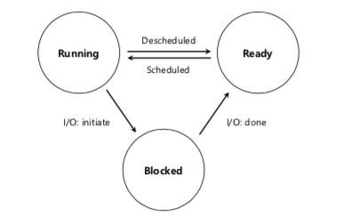
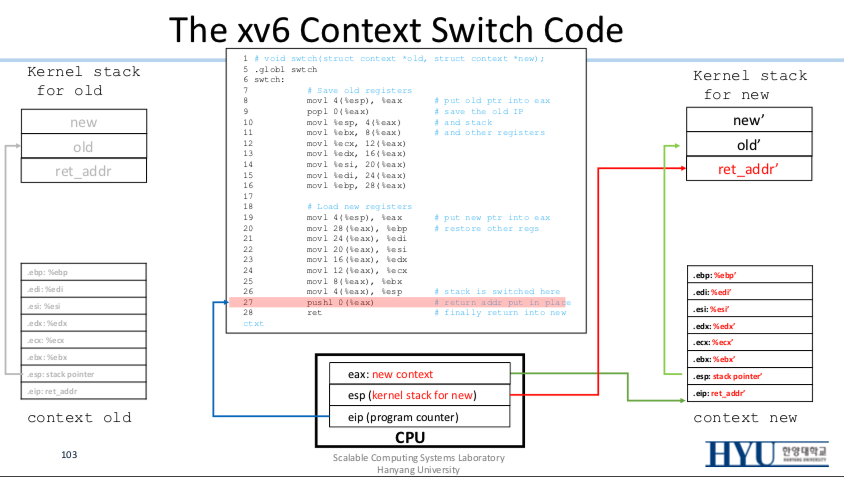
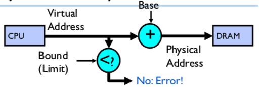
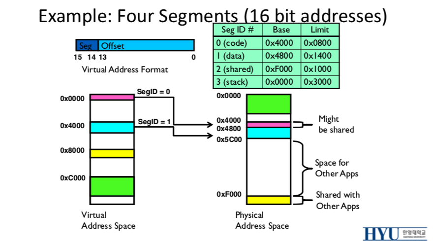
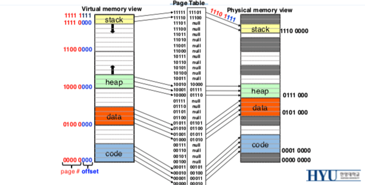

# ⚙️ 운영체제

### ✔️ 운영체제

- Design Goals
    - 추상화(Abstraction)
    - 고성능(High performance)
    - 애플리케이션 보호(Protection between applications)
    - 높은 안정성(High reliability)
- 자원 관리자로서의 운영체제
    - **CPU**를 여러 프로그램이 **공유**할 수 있게 함
    - 여러 프로그램이 동시에 **메모리** 상의 각자의 명령어(instruction)와 데이터를 접근할 수 있게 함
    - 여러 프로그램이 **디스크** 등의 디바이스에 접근할 수 있게 함
    - ⇒ **가상화** (Virtualization)를 통해 유한의 자원을 무한 개의 프로그램들이 나누어 사용할 수 있도록 API 제공


### ✔️ 프로세스 (Process)

- 실행 중인 프로그램 (running program)
- 프로세스 입장에서 많은 가상 CPU, 가상 메모리가 있는 것처럼 느끼게 하는 것이 운영체제의 역할 중 하나 (promote illusion)
- 프로세스 생성 순서
    1. 프로그램 코드를 메모리에 로드
    2. 프로그램의 런타임 *stack* 할당, stack arguments (argc, argv 초기화)
    3. 프로그램의 *heap* 영역 할당
    4. Entry point 실행 (주로 main())
- 프로세스의 상태



- PCB(Process Control Block): 운영체제가 각 프로세스에 대해 가지고 있는 정보

```c
struct proc {
	char *mem; // Start of process memory
	uint sz; // Size of process memory
	char *kstack; // Bottom of kernel stack for this process
	enum proc_state state; // Process state
	int pid; // Process ID
	struct proc *parent; // Parent process
	int killed;
	struct file *ofile[NOFILE]; // Open files
	struct inode *cwd; // / Current directory
	struct context context; // // Switch here to run process
	struct trapframe *tf; // // Trap frame for the current interrupt
}
```


### ✔️  Limited Direct Execution

- I/O 작업이나 CPU, memory 등의 리소스를 사용하는 작업은 프로세스가 직접 수행할 수 없게 하며 운영체제를 통해 **간접적**으로 수행하게 하는 정책
- 유저 모드 & 커널 모드
    - **User mode(유저 모드)**: 하드웨어 리소스에 full access를 할 수 없는 상태
    - **Kernal mode(커널 모드)**: 모든 자원을 사용할 수 있는 상태로, 운영체제가 실행 중인 상태의 권한
- **Mode Switch**
    - 유저 모드와 커널 모드 사이를 전환하는 것
    - 하드웨어 자원을 사용하는 작업은 커널을 통해 간접적으로 수행되도록 한다 (커널 모드에서만 동작)
    - User process는 **system call**을 통해 권한이 필요한 명령을 요청함
        - ❗️ System call은 interrupt의 일종임 (int 0x80)
    - ❗️ Mode Switch시 stack 영역 자체가 전환됨


### ✔️ Process Switching & Context Switch

- Process Switching의 방법
    1. 실행 중인 프로세스가 system call을 통해 양보하도록 기다린다 ⇒ 👎 (무한 루프 발생하면?)
    2. 운영체제가 강제로 실행 중인 프로세스를 중단하고 다른 프로세스를 실행시킨다 ⇒ 👍
        - 하드웨어 자원을 이용하여 주기적으로 **timer interrupt**를 발생시켜 운영체제가 CPU를 점유하도록 한다
- **Context Switch**
    - 실행 중이던 프로세스(혹은 task)의 상태를 저장하고 다음 진행할 프로세스의 상태 값을 읽어 적용하는 과정
    - 순서
        1. 레지스터 값을 현재 커널 스택에 저장한다
        2. 다음 실행될 커널의 스택에 있는 저장된 레지스터 값을 복구한다
        3. 커널 스택을 전환한다.
- ⚠️  Cache miss 등의 이유로 오버헤드가 크므로, 스케줄링 시 conext switch 오버헤드를 고려하고 알고리즘을 선정해야 한다




### ✔️ 프로세스 스케줄링 방법

- 구분
    - **비선점**(Non-Preemptive) 스케줄링: 이미 시작된 프로세스는 끝날 때 까지 작업을 수행함
    - **선점**(Preemptive) 스케줄링: 실행 도중 프로세스를 종료하고 다른 프로세스를 수행할 수 있음
- 측정 기준(Metrics)
    - **Turnaround time**(반환 시간) = Completion time - Arrival time
    - **Response time**(응답 시간) = First-run time - Arrival time
- 비선점 스케줄링
    - **FIFO:** First-in first-out = FCFS; First Come First Service
    - **SJF**: Shortest Job First
- 선점 스케줄링
    - **RR(Round Robin)**: Time slice(quantum) 동안 실행된 후 다른 프로세스에 양보
    - **MLQF(Multi-Level Feedback Queue)**
        - 큐를 여러 단계로 나누어 두어 수행 시간이 긴 프로세스의 우선순위를 낮게 하고, 새로 들어온 프로세스들에게 우선적으로 실행 될 기회를 주는 방식
        - 규칙 1: Priority(A) > Priority(B) 이면 A를 실행
        - 규칙 2: Priority(A) = Priority(B) 이면 A와 B를 RR로 실행
        - 규칙 3: 가장 처음 들어온 프로세스는 가장 높은 prioirty를 받음
        - 규칙 4: 프로세스가 모든 time slice를 전부 사용하면 priority를 감소
        - ⚠️ 너무 많은 프로세스가 존재하면 Starvation 현상 발생 가능 → priority boost를 일정 주기마다 실행해준다 (모든 프로세스의 priorty를 가장 높게 초기화; 규칙 5)
- **Fair-share 스케줄링**
    - CPU time의 특정 비율(지분)만큼 작업이 수행되도록 보장
    - **Lottery scheduling**
        - 확률만큼 ticket을 갖게 한 후 랜덤하게 선택
        - A가 60%, B가 40%의 share를 가지고 있다면 `[A, A, A, B, B]` 의 배열을 만든 후 랜덤하게 하나를 뽑는 방식
        - ⚠️ Sample 수가 작으면 랜덤의 특성상 공정하게 분배가 되지 않는다
    - **Stride Scheduling**
        - `stride = some-const / tickets`;
        `pass += stride`
        - 가장 pass가 작은 프로세스 실행
            - ticket이 적은 프로세스는 stride가 커지므로 덜 수행될 것이고, ticket이 많은 프로세스는 stide가 작으므로 더 많이 수행될 것이다


### ✔️ 메모리 가상화 (Memory Virtualization)

- 프로세스가 사용하는 메모리 주소와(virtual address) 하드웨어가 사용하는 메모리 주소(physical address)는 달라야 한다. (프로세스는 주어진 범위 내의 주소만 사용할 수 있어야한다)
- **Base & Bound 레지스터 사용**
    - 하드웨어 기반으로 RAM에 접근하기 전에 base 레지스터와 bound 레지스터를 이용해서 주소를 전환 (transition) 및 limit 검사를 수행한다
    - `physical_address = virtual_address + base`;
    `0 ≤ virtual_address < bound`
    - PCB에 base & bound 레지스터도 정보도 저장되어야함
    - ⚠️ Internal fragmentation 문제가 존재한다 (free space가 너무 큼)
    - ⚠️ Address space를 여러 개로 나눠 사용할 수 없다 (Code / Data / Stack)
    - ⚠️ 프로세스 간 메모리 공유가 힘들다 (Code 영역, 쓰레드간)



- **Segmentation**
    - Address space를 세그먼트들로 나눈다 (code, stack, heap)
    - 각 세그먼트는 base & bound 레지스터를 가지고 있다
        - Instruction에서 해당 address가 어떤 segment인지 알 필요가 있는데, 이는 address bit에 encoding 하는 방식으로 처리한다 (맨 앞 1~2비트 등)
    - 💡 Segmentation fault: 세그먼트의 bound를 보고 주소가 이를 넘어가면 내는 오류
    - ⚠️ 하지만 여전한 **fragmentation** 문제
        - **External:** 청크(세그먼트) 사이의 빈 공간 존재
        - **Internal:** 세그먼트 크기 만큼의 메모리가 필요하지 않을 수 있음



- **페이징 (Paging)**
    - 프로세스 주소를 쪼개는 대신, 물리적 메모리 주소 자체를 고정된 크기로 쪼개어 사용.
    - 이 때 쪼개지는 단위를 **페이지(page)**라 함
    - **페이지 테이블(page table)**
        - Virtual address를 physical address로 치환하기 위한 요소
        - 프로세스마다 페이지 테이블을 갖고 있어야 함
        - 페이지 테이블의 요소: `VPN`(Virtual Page Number), `PFN`(Page Frame Number), `Flags`(validation, protection, present, dirty, ...)
        - 가상 메모리 주소(virtual address)는 `VPN`과 `offset`으로 구성
    - **TLB (Transition Lookaside Buffer)**
        - 페이지 테이블에 대한 캐시
        - Temporal Locality, Spatial Locality 바탕으로 erase 할 요소 선택
            - **Temporal Locality:** 한 번 참조한 페이지는 가까운 시간 내에 계속 참 조할 가능성이 높음
            - **Spatial Locality:** 일정 위치의 페이지를 집중적으 로 액세스하는 현상 (array, code)
        - TLB는 하드웨어 자원이므로 프로세스마다 가지고 있지 않음 → 엔트리마다 어떤 프로세스에서 사용한 페이지인지 정보를 들고 있어야함 (ASID 필드)
    - **Multi-level Page Tables**
        - **⚠️** Internal fragmentation과 페이지 테이블 크기는 trade-off 한 문제가 있음
            - 페이지 테이블이 커지면 fragmentation 증가, 테이지 테이블을 줄이면 가용 주소가 너무 작아짐
        - **Page Directory**를 두고 PFN이 다른 Page Table, 혹은 Page Directory를 가르키도록 만듬
        - **장점:** 필요한 크기만큼의 page table 구성 가능
        - **단점:** 메모리 transition 시간 증가
        - x86: 4-level로 구성 (32bits의 주소 = 9 bits + 9 bits + 9 bits + 9 bits + 12 bits offsets)
            - 때문의 페이지의 크기는 2<sup>12</sup> = 4KB 이다.





### ✔️ 페이지 교체 (Page Swap)

- 메인 메모리의 크기는 제한적이므로, 메모리가 모두 사용 중이면 디스크에 메모리 정보를 저장한다.
- 이 때 사용하려는 페이지가 메인 메모리에 없으면 디스크에서 이를 올려야 한다.
    - 어떤 페이지를 없앨 지(디스크에 내릴지)를 정하는 기준 ⇒ 페이지 교체 알고리즘
- **페이지 교체 알고리즘**
    - **FIFO**(First-in First-out)
    - **LRU**(Least Recently Used): 가장 오랫동안 사용하지 않는 것 제거
    - **LFU**(Least Frequently Used): 사용 빈도가 가장 낮은 것 제거
    - **Clock**: Approximating LRU; 순환 리스트를 이용하여 최소한의 자원으로 가장 오랫동안 사용하지 않은 것에 근접하는 페이지 제거
- 💡 페이지 교체 알고리즘은 캐시(cache) 교체 알고리즘과도 일맥상통
- 캐시(cache)와 관련된 metrics
    - *average memory access time = (hit rate * cache access time) + (miss rate * disk access time)*
    - *hit rate = hits / (hits + misses)*
- ❗️스래싱(Thrashing): 프로세스 처리 시간보다 교체 시간이 더 많아지는 현상


### ✔️ 쓰레드 (Thread)

- 한 프로그램에서 병렬적으로(parallellism) 작업을 수행할 수 있도록 운영체제에서 제공하는 API
- ❗️쓰레드끼리는 메모리를 공유한다
    - 단 stack은 공유하지 않음 (애초에 여러 프로세스가 stack을 공유할 수 없다)
    - 메모리를 공유하니 switch overhead, TLB miss 등이 적어져 성능 이득
    - **⚠️** 쓰레드간 수행 순서에 따라서 **race condition**이 생길 수 있다


### ✔️ 동시성 제어 (Concurrency Control)

- **임계 구역(Critical Section)**: 한 번의 하나의 프로세스만 접근할 수 있는 구간
- **상호 배제(Mutual Exclusion)**: 특정 프로세스가 공유 자원을 사용하고 있을 경우 다른 프로세스가 해당 공유 자원을 사용하지 못하게 제어하는 기법
- **Lock:** 운영체제에서 지원하는 mutual exclusion을 보장하게 해주는 API. Critical section 내의 코드를 single atomic instruction 처럼 실행해 줌
    - Lock을 구현하기 위해서는 보통 하드웨어의 도움을 받는다
    - **Atomic instruction**: 하드웨어에서 보장하는 실행 도중 다른 instruction이 끼어들지 않도록 보장하는 명령. 원자와 같이 쪼개지지 않는다는 의미에서 atomic instruction이라 부른다.
        - 대표작인 예시로 TAS(TestAndSet)과 CAS(CompareAndSwap)이 있다.
        - `while (TAS(&lock->flag, 1) == 1)`나 `while (CAS(&lock->flag, 0, 1) == 1)`로 spin lock을 구현할 수 있음

```c
int TestAndSet(int *ptr, int new) {
	int old = *ptr; // fetch old value at ptr
	*ptr = new; // store ‘new’ into ptr
	return old; // return the old value
}

int CompareAndSwap(int *ptr, int expected, int new) {
	int actual = *ptr;
	if (actual == expected)
		*ptr = new;
	return actual;
}
```


### ✔️ 교착 상태 (Deadlock)

- 두 개 이상의 작업이 서로 상대방의 작업이 끝나기 만을 기다리고 있기 때문에 결과적으로 아무것도 완료되지 못하는 상태
- 식사하는 철학자들 문제 (**Dining Philosophers Problem**)
    - 원을 두르고 철학자들이 앉아 있고, 각자의 옆에 포크가 하나씩 있을 때, 양 옆의 포크를 모두 들어야 음식을 먹을 수 있다. 이 때 각각의 철학자가 왼쪽과 오른쪽의 포크를 동시에 들면 아무도 음식을 먹을 수 없지 못하며 무한정 상대방을 기다리는 교착상태에 빠지는 문제
- **발생 조건 (4가지 모두 해당되어야 함)**
    1. Mutual Exclusion: 점유한 자원에 대해서 쓰레드는 독점권(exclusive control)을 갖는다
    2. Hold-and-wait: 쓰레드가 자원을 점유 한 동안 다른 쓰레드는 이를 기다린다
    3. No preemption: 쓰레드가 점유한 자원은 함부로 뺐을 수 없다
    4. Circular wait
- **예방(Prevention) 기법**: 위 4가지 발생 조건 중에서 어느 하나를 제거(부정)
- **회피(Avoidance) 기법**: 발생 가능성을 배제하지 않고, 교착 상태가 발생하면 적절히 피해가는 방법
    - 은행원 알고리즘 (Banker's Algorithm)


### ✔️ 파일 시스템 (File Systems)

- File(파일)
    - Named permanent storage
    - Data & Metadata를 가지고 있다
- In-Memory File System Structure
    - Kernel memory에 per-process open-file table 가지고 있음
    - Secondary storage에 data block 및 file-control block 존재
- FAT (File Allocation Table)
    - Linked list 형태로 블록 저장
    - Sequential file write시 next로 타고 들어가 free space를 바로 allocate 할 수 있음
    - 단점: access method가 없어 검색 시 매번 list traversal을 수행해야 함


### ✔️ I/O

- 데이터 전송 단위 별 디바이스 종류
    - 블럭(Block): 디스크, 테이프, DVD 등; `open(), read(), write(), seek()` 인터페이스 사용
    - 캐릭터(Character): 키보드, 마우스, 시리얼 포트 등; 한 번에 하나의 character 통신
    - 네트워크(Network): 이더넷, 블루투스, Wireless 등; 모두 인터페이스가 다름 or `socket` 사용
- I/O 인터페이스 구현 방법
    - **Blocking** Interface: "Wait"
    - **Non-blocking** Interface: “Don’t Wait”
    - **Asynchronous** Interface: “Tell Me Later”. Callback의 개념이라 볼 수 있으며, 운영체제에서는 signal을 통해 구현한다
- **디바이스 인터렉션의 종류**
    - I/O instructions: 운영체제가 디바이스 레지스터에 간접적으로 데이터를 전송함
    - **Memory-mapped I/O**: 디바이스 레지스터가 마치 메모리에 맵핑(mapping)되어있는 것 API를 제공함. 해당 **주소**로 접근 시 운영체제에서 메인 메모리 대신 디바이스로 접근함
- 데이터 통신 방법
    - Programmed I/O: 바이트마다 load/store 혹은 in/out 을 통해 전송됨
    - Direct Memory Access(**DMA**)
        - Controller가 메모리 버스에 직접 접근할 수 있도록 함
        - 복제할 메모리의 위치와 크기를 미리 알려야 함
        - 완료시 DMA가 interrupt를 발생
- I/O Device Notifying the OS
    - **I/O Interrupt**: 디바이스가 필요시 interrupt 발생
        - Context switch를 하여 다른 task를 수행하다가 인터럽트가 도착하면 다시 context switch해서 원래 프로세스를 실행시킴
        - 기다리는 동안 다른 작업 수행이 가능하지만 context switch overhead 존재
    - **Polling**: 운영체제가 주기적으로 device별 상태 레지스터(status register)를 확인함
        - 디바이스가 준비 될 때까지 운영체제가 반복적으로 상태 레지스터를 확인 (cycle이 낭비된)


### ✔️ RAID (Redundant Arrays of Inexpensive Disks)

- RAID Level 0: Striping
    - 데이터를 모든 disk에 나눠서 보관
    - 성능(Performance) 및 용량(Capacity) 측면에선 최고, 안정성(Reliability) 측면 최악
- RAID Level 1 : Mirroring
    - 하나의 데이터를 2개의 disk에 저장
    - Reliability: Tolerates 1 disk failure
    - Capacity: N / 2
- RAID Level 4 : Saving Space With Parity (XOR bit)
    - 하나의 디스크를 parity로 두고 XOR bit들을 저장
    - Capacity: N-1
    - Reliability: Tolerates 1 disk failure
    - Parity disk가 bottleneck이 될 수 있음 (항상 해당 디스크에 access가 발생하기 때문)
- RAID Level 5: Rotating Parity
    - Parity bit를 디스크마다 나누어서 들고있는 방식


---


### 참고 자료

- 한양대학교 운영체제 수업 강의자료, 정형수 교수 (ELE3021)
  - 교재 - Operating Systems: Three Easy Pieces, Remzi Arpaci-Dusseau 외
