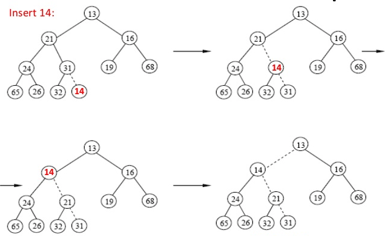

# 자료구조 & 알고리즘

## 📔 자료구조

### ✔️ 연결 리스트 (Linked List)

- 포인터를 이용해서 자료를 연속적으로 저장하는 방식
- 시간 복잡도 (Time Complexity)
    - 검색: `O(n)`
    - 삽입/삭제: `O(n)`


### ✔️ 큐 (Queue) & 스택 (Stack) & 데크 (Deque)

- 큐(Queue)
    - FIFO (First-in First-out); 삽입 시 리스트의 가장 마지막에 추가되며, 삭제 시 가장 앞의 요소가 나온다
- 스택(Stack)
    - LIFO(Last-in First-out); 삽입 시 리스트의 가장 앞에 추가되며, 삭제 시에도 가장 앞의 요소가 나온다
    - 함수 호출의 순서 제어 및 postfix notation으로 표현된 식 연산 시 사용이 가능하다
- 데크(Deque; Double Ended Queue)
    - 삽입과 삭제가 리스트의 양 끝에서 모두 발생 가능한 자료구조


### ✔️ **트리 (Tree)**

- Cycle이 없는 그래프
- 용어
    - Degree(차수): 노드 별 자식의 수, 혹은 트리의 경우 차수 중 가장 큰 수
    - Terminal Node(단말 노드; Leaf Node): 차수가 0인 노드
    - None-Terminal Node(비단말 노드): 차수가 0이 아닌 노드
    - Sibling(형제 노드): 동일한 부모를 갖는 노드들


### ✔️ 이진 트리 (Binary Tree)

- 노드의 차수가 2인 트리
    - 한 레벨의 최대 노드 개수는 `2^(i-1)`
- 완전 이진트리 (complete binary tree): 마지막 level을 제외하고 모든 level의 노드가 `2^(i-1)` 인 것; 모두 채워진 것
- **트리 순회 (Traversal)**
    - **In-order:** 왼쪽 노드 - 자신 - 오른쪽 노드 순으로 탐색
    - **Pre-order:** 자신 - 왼쪽 노드 - 오른쪽 노드 순으로 탐색
    - **Post-order:** 왼쪽 노드 - 오른쪽 노드 - 자신 순으로 탐색


### ✔️ 이진 검색 트리 (Binary Search Tree; BST)

- **조건**
    - 노드 왼쪽에 있는 모든 서브트리의 값은 노드 값보다 작음
    - 노드 오른쪽에 있는 모든 서브트리의 값은 노드 값보다 큼
- **시간 복잡도 (Time Complexity)**
    - 검색: `O(log n)`
    - 삽입/삭제: `O(log n)`
- **삽입**
    - 위치를 찾아가며 빈 위치에 넣으면 됨
- **삭제**
    - 자식이 하나 있으면 노드를 삭제하고 그 자식을 위로 올리면 됨
    - 자식이 둘 있으면 오른쪽 자식의 서브트리 중 가장 작은 값으로 교체하고, 해당 노드 다시 삭제
        - 가장 작은 값은 가장 왼쪽에 있는 값이며, 이 노드는 자식이 하나 이하 있음이 보장됨


### ✔️ 힙 (Heap)

- 완전이진트리(Complete binary tree)
- 부모의 값이 자식의 값보다 항상 크거나 작음 (큰 경우: max-heap, 작은 경우: min-heap)
- 배열로 표현 가능
    - 부모가 `n[i]`일 때 왼쪽 자식은 `n[i*2]`, 오른쪽 자식은 `n[i*2+1]`
- **삽입**
    - 가장 마지막에 (n[n.len])에 노드 삽입 후, 위 방향으로 percolating 수행



- **삭제 (pop; delete min)**
    - 가장 마지막의 노드를 첫 번째로 옮긴 후 아래 방향으로 percolating 수행

```c
void percolateDown(int[] A, int i, int N) {
    int child = 2 * i;
    int rightChild = 2 * i + 1;
    if (child >= N)
        return;
    if (rightChild < N && A[rightChild] < A[child]) // Min-heap
        child = rightChild;
    swap(A[i], A[child]);
    percolateDown(A, child, N);
}
```

- **시간 복잡도 (Time Complexity)**
    - 검색 / 삽입 / 삭제: `O(log n)`
    - Build heap: `O(n)`
    - Heap sort: `O(nlog n)`


### ✔️ 다른 트리들

- **AVL**(Adelson-Velskii and Landis)
    - 왼쪽 서브트리와 오른쪽 서브트리의 높이 차이가 1보다 크면 안됨
    - 삽입 및 삭제시 조건을 검사하고 불만족시 회전 (rotate)
- **B-Tree**
    - 노든 leaf 노드의 level이 같음
    - 한 노드의 키는 최대 b-1개
    - 모든 non-leaf 노드는 b-1이상 b미만의 자식 수를 가짐
- **RB(Red Black) Tree**
    - 노드의 색깔을 red나 black으로 둠
    - 제약조건들을 바탕으로 트리가 한쪽으로 쏠리지 않게 해줌


### ✔️ 해싱 (Hashing)

- 같은 값을 넣으면 항상 같은 값이 나오는 함수(Hash Function)를 이용하여 키를 찾아내고, 이를 테이블의 인덱스로 사용하여 조회 및 삽입을 하는 방식
- 해시 테이블 (Hash Table): 고정된 크기를 가진 key-value 형식의 자료구조 (주로 배열 사용)
- 해시 테이블의 크기가 충분하면 검색, 삽입, 삭제 모두 `O(1)`의 시간 복잡도를 가짐
- **해시 함수 (Hash Function)**
    - 나머지 연산(mod)를 이용하는 방법
    - ASCCI 코드를 이용하는 방법
    - 기타 등등
- **충돌 (Collision)**
    - 2개 이상의 레코드가 같은 키를 가질 수 있는 문제
    - 방법 1: Separate chaining
        - 해시 테이블의 각 레코드를 linked list로 구성하고, 검색 시 순회하는 방식
    - 방법 2: Open addressing
        - 이미 레코드가 사용 중이면 다른 빈 공간을 사용하는 방식
        - Linear probing: 순차적으로 다음 빈 레코드에 삽입
        - Quadratic probing: 키를 `i^2` 순으로 증가시켜 빈 공간 검색
    - 방법 3: Extendible hashing
        - Directory 구조로 해시 테이블을 구성하는 방식


## ⏳ 알고리즘

### ✔️ 정렬

- **버블 정렬 (Bubble Sort)**
    - 서로 인접한 2개의 레코드를 비교하여 크기가 순서대로 되어 있지 않으면 swap
    - 1회전시 d[1]와 d[2], d[3]와 d[4], ... d[n-1]와 d[n]를 비교한다
    - k회전시 n-k+1번 까지만 비교를 수행하면 된다
    - `O(n^2)`
- **선택 정렬 (Selection Sort)**
    - 해당 순서에 원소를 넣을 위치는 이미 정해져 있고, 어떤 원소를 넣을지 선택하는 알고리즘
    - k회전시 k ~ n번째 레코드들을 보아야 한다.
    - `O(n^2)`
- **삽입 정렬 (Insertion Sort)**
    - 2번째 레코드부터 앞의 레코드들을 보며 자신이 위치해야 할 곳으로 삽입 하면서 정렬한다
    - k번째 레코드는 1~(k-1)번째 레코드들과 비교해야한다
    - `O(n^2)`
- **합병 정렬 (Merge Sort)**
    - 대표적인 분할 정복(divide and conquer) 방법
    - 원소의 크기가 1이 될 때까지 두개로 분할한 후, 2개의 리스트의 값들을 처음부터 하나씩 비교하여 두 개의 리스트의 값 중에서 더 작은 값을 새로운 리스트(sorted)로 옮긴다.
    - `O(n^2)`
    - ❌ In-place algorithm(제자리 알고리즘)이 아니다; `O(n)`만큼의 새로운 공간 요구
- **힙 정렬 (Heap Sort)**
    - 배열의 요소로 max heap을 build 하고, 하나씩 요소를 꺼내서 배열의 뒤부터 저장하면 된다. (별도 공간 불필요)
    - `O(nlog n)`
    - ✅ In-place algorithm임
- **퀵 정렬 (Quick Sort)**
    - 개념
        - 리스트 안의 한 요소를 고르고, 이를 피벗(pivot)이라 한다. 피벗을 기준으로 작은 요소들은 피벗 왼쪽으로 보내고, 큰 요소들은 오른쪽으로 보낸다
        - 피벗을 제외한 왼쪽 리스트와 오른쪽 리스트 각각에 대해 위 작업을 반복한다.
    - 구현 방법
        - `low` 포인터와 `high` 포인터를 두고, low는 오른쪽으로 이동하다가 피벗보다 큰 요소를 찾으면 멈춘다. high는 왼쪽으로 이동하다가 피벗보다 작은 요소를 찾으면 멈춘다. 두 포인터 모두 멈추면 교환하고, 두 포인터가 엇갈릴 때까지 반복한다.
    - 평균 시간복잡도: `O(nlog n)`, 최악 시간복잡도: `O(n^2)`
    - ⚠️ 최악의 경우(Worst Case)
        - 리스트가 잘 나눠지지 않는 경우 (피벗이 최대값, 혹은 최솟값으로 뽑혀서 리스트가 나누어지지 않고 길이만 1씩 줄어드는 경우)
    - ⁉️ In-place algorithm이라고 할 수도 있고, 그렇지 않다고 할 수도 있다
        - O(log n) 만큼의 space를 필요로 하며, 최악의 경우에 O(n)까지도 필요하다.


### ✔️ BFS와 DFS

- **BFS(너비 우선 탐색; Breadth-first search)**
    - 큐(queue)를 이용하여 탐색을 수행한다
- **DFS(깊이 우선 탐색; Depth-first search)**
    - 스택(stack)이나 재귀 함수(혹은 순환 호출)를 이용하여 탐색을 수행한다


### ✔️ 다익스트라 (Dijkstra)

- 출발점(source)이 명시되어있고, 각 노드까지의 최단 경로를 구하는 알고리즘
- 개념
    - BFS를 기본으로 한다
    - 큐에 있는 vertex들을 하나씩 꺼내며 이웃들의 최단경로를 갱신해준다
        - `dist[v] = min(dist[v], dist[u] + edge[u][v])`
    - ❗️큐에서 vertex를 꺼낼 때에는 가장 짧은 최단 경로를 가진 놈을 먼저 꺼내도록 한다
- 기본 시간복잡도: `O(V^2 + E)`

```js
dist[source] ← 0
create vertex set Q

for each vertex v in Graph:
  dist[v] ← INFINITY  // 소스에서 v까지의 아직 모르는 길이
	prev[v] ← UNDEFINED  // 소스에서 최적 경로의 이전 꼭짓점
	add v to Q  // 모든 노드는 초기에 Q에 속해있다 (미방문 집합)

dist[source] ← 0  // 소스에서 소스까지의 길이

while Q is not empty:
	u ← vertex in Q with min dist[u] // 최소 거리를 갖는 꼭짓점을 가장 먼저 선택한다
	remove u from Q

	for each neighbor v of u:           // v는 여전히 Q에 있다.
		alt ← dist[u] + length(u, v)
		if alt < dist[v]:               // v 까지의 더 짧은 경로를 찾았을 때
			dist[v] ← alt
			prev[v] ← u

return dist[], prev[]
```


---

### 참고 자료

- 한양대학교 자료구조론 수업 강의자료, 노미나 교수 (CSE2010)
  - 교재 - Fundamentals of Data Structures in C 2/e, Horowitz 외
- 한양대학교 알고리즘 수업 강의자료, 박희진 교수 (ITE2039)
  - 교재 - Introduction to Algorithms 3/e, T Cormen, C 외
- https://gmlwjd9405.github.io
