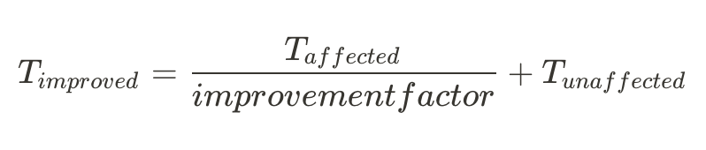
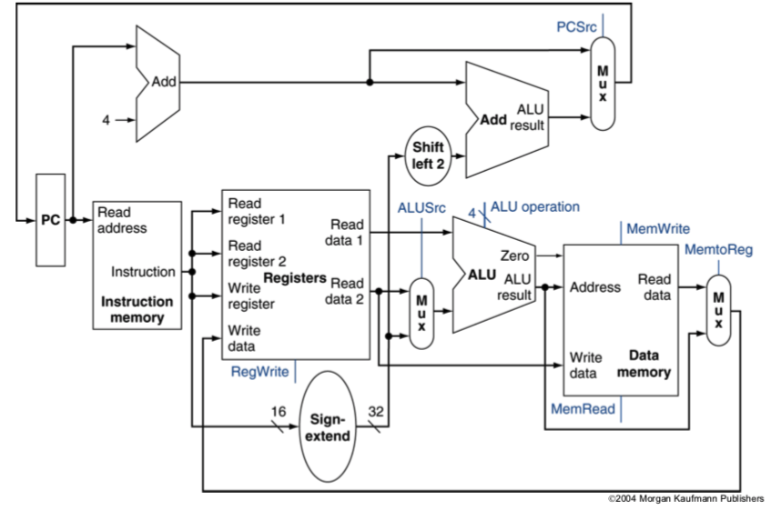
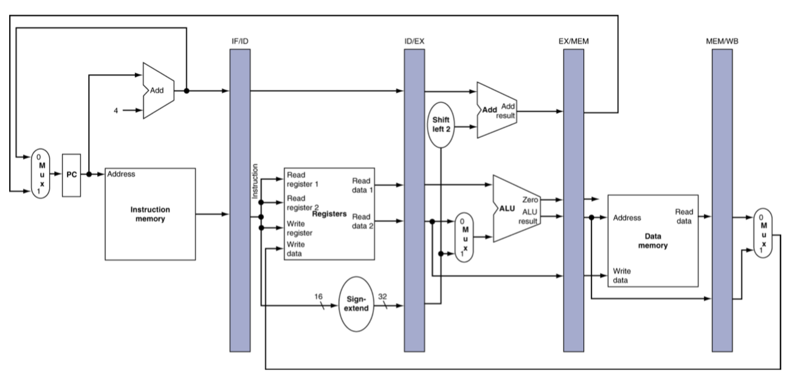
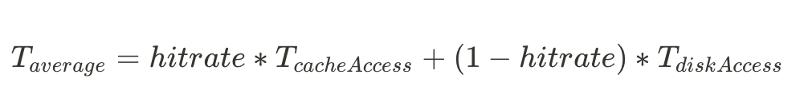
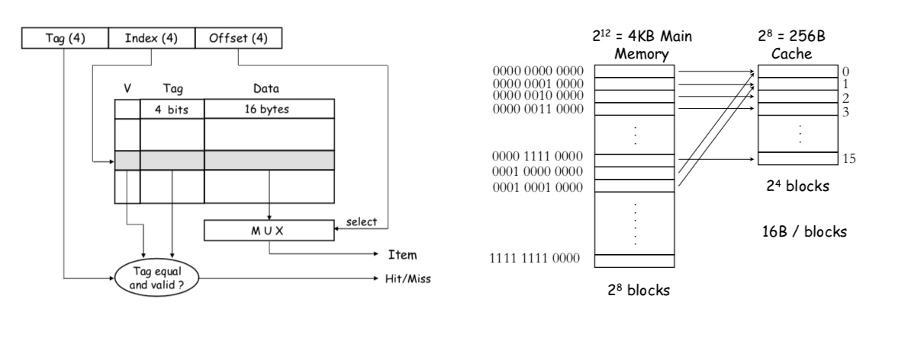
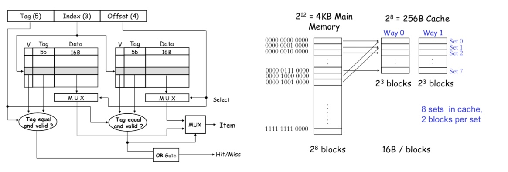
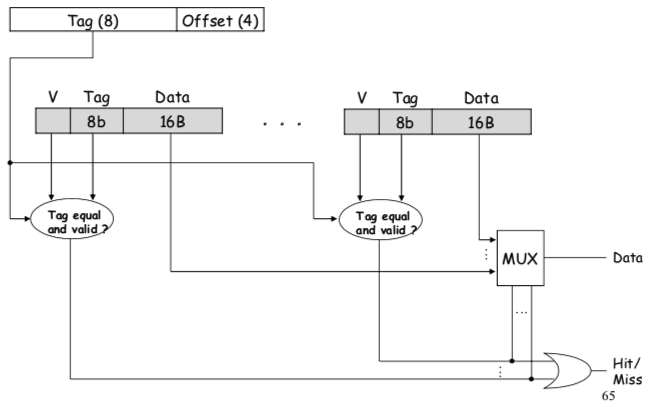

# 🧱 컴퓨터구조

### ✔️ 컴퓨터 성능을 결정하는 요소

- **IC** (Instruction Count)
    - 하드웨어가 실행해야 하는 instuction의 실제 수
    - 같은 프로그램이라도 달라짐 ISA의 종류나 컴파일러의 역량에 따라 달라짐
        - 또한 input data에 따라서도 변함
- **CPI** (Cycle-per-Instruction)
    - Instruction의 수행 시간으로, instruction의 마다 다름 (일반연산, multiplication, floating)
    - High-level organization(Pipeline, Cache 등) 설계에 따라 여향을 받음
- **cct** (Clock Cycle Time)
    - 클럭 한 주기의 길이
    - Low-level circuit design에 가까운 영역

### ✔️ RISC & CISC

- **RISC (Reduced Instruction Set Computer)**
    - Instruction 하나가 하는 일이 작음
    - `IC` 증가
    - `CPI*cct` 감소
    - ISA가 단순하여 pipelining에 유리
        - → `CPI` 감소
- **CISC (Complex Instruction Set Computer)**
    - 상황에 따라 가장 compact 한 instruction 사용
    - 메모리 공간을 적게 차지한다는 이점 → 현재에 와서는 공간에 대한 제약이 적기에 큰 의미 X
    - `IC` 감소, `CPI*cct` 증가

### ✔️ Amdahl's Law

- 자주 쓰이는 곳에 투자를 해야 효과가 있음(make common case faster)을 의미
- RISC의 전략과 맞닿아 있는 부분으로, 간단하지만 자주 사용되는 instruction의 수행시간을 줄이자

### ✔️ MIPS instruction design

- **R-format Instructions**
    - 각 포맷이 의미하는 것
        - `op`: operation code (opcode)
        - `rs`: first source register number
        - `rt`: second source register number
        - `rd`: destination register number
        - `shamt`: shift amount (00000 for now)
        - `funct`: function code (extends opcode)
    - 예시
        - `add $t0, $s1, $s2`
    - 3주소 명령어라고도 함
- **I-format**
    - 각 포맷이 의미하는 것
        - `rs`: base address
        - `rt`: destination or source register number
        - `constant`: -2^15 ~ 2^15 - 1
        - `address`: offset added to base address in `rs`
    - 예시
        - `lw $t0, 32($s2)`
        - `sw $t0, 16($s3)`
        - `addi $s3, $s3, 4`
        - `beq $s1, $s2 label`
            - 이 때 destination(target address)은 `PC + offset * 4` 가 된다
    - 2주소 명령어라고도 함
- **J-format**
    - Jump instruction에 사용
    - Target address = `address * 4`
        - Boundary: 256MB(2^28) → Code segment의 최대 크기
- **Operand Types**
    - Word: 32bits
    - Halfword: 16bits
    - Byte: 8bits

### ✔️ Procedure Execution

- Procedure 실행을 위한 작업 순서
    1. Parameter 값을 레지스터에 저장 (`$a0 - $a3`)
    2. 실행을 위해 PC 변경 (jump and link)
    3. 필요 자원 획득
    4. 작업 수행
    5. 결과를 저장하여 calling procedure (호출자)가 그 값을 받을 수 있도록 함 (`$v0 - $v1`)
    6. Caller로 돌아가기 위해 PC 변경 (jump register - `$ra`)
- Caller saving & Caller saving
    - 레지스터에 있는 caller 데이터를 지워야 할 수도 있다.
    - Caller saving
        - Procedure 호출 전에 caller가 저장해두는 것
        - ⚠️ Callee에서 쓰지도 않는데 저장한다면 비 효율적
    - Callee saving
        - 이미 사용 중인 레지스터라면 callee가 저장 후 해당 레지스터 재사용
        - ⚠️ 꼭 저장해야 할 레지스터인지 알 수 없음
    - MIPS의 정책 → Saved registers(`$s`)와 Temporary registers(`$t`)의 분리

### ✔️ Single Cycle Design

- Instruction 간략한 분류
    - 메모리 참조: `lw`, `sw`
    - 산술논리(Arithmetic-logical): `add`, `sub`, `and`, `or`, `slt`
    - 컨트롤 플로우: `beq`, `j`
- 3가지 반복되는 단계
    - Instruction Fetch (**IF**): PC ← PC + 4
    - Instruction Decode (**ID**): Instruction을 어떻게 수행할 지 결정
        - 레지스터 수에 따라 레지스터 read
    - Instruction Execute (**EX**): Instruction 수행
        - ALU를 이용하여 연산
            - 수식 계산
            - load/store를 위한 메모리 주소 계산

### ✔️ Pipelining & Hazzards

- Pipelining을 이용하면 최대 stage 수 배 만큼 성능을 향상시킬 수 있음
- **5 Stages**
    - IF (Instruction Fetch)
    - ID (Instruction Decode)
    - EX (Execute / Address caculation)
    - MEM(Memory Access)
    - WB(Write Back)
- **Hazards**
    1. **Structural hazards**: 리소스가 바쁜 경우
        - Instruction 메모리와 data memory가 물리적으로 분리되어 있지 않는 경우
            - lF stage의 Instruction memory와 MEM stage의 Data memory
    2. **Data hazard**: 데이터 read/write로 인해 이전 instruction이 끝날 때까지 기다리는 경우
        - **ALU Data Hazard**
            - Lose two cycles (2개 버블 inject 필요)
            - 해결책: 뒤 2개 연산에 대해 **ALU**로 데이터를 보내기 전에 **포워딩(forwarding)**
                - WB stage에서 EX stage로 (2개 뒤의 instruction)
                - MEM stage에서 EX stage로 (바로 뒤의 instruction)
                - → Cycle lose ❌
        - **Load-Use Data Hazard**
            - 2개 뒤의 instruction의 경우 WB stage에서 EX stage로 forwarding 가능
            - ⚠️ 바로 뒤의 instruction은 forwarding 불가 **(1개 cycle stall 항상 필요)**
    3. **Control hazard** (Branch Hazards): 이전 instruction의 결과가 flow of control을 결정
        - branch outcome은 MEM stage에서야 나옴
        - 해결책: Branch prediction
            - bit comparision을 이용해서 더 앞 스테이지에서 빠르게 체크 (ID stage)
            - 이 때 바로 앞의 instruction이 Load 라면 **2개 cycle stall**이 필요하다
                - WB stage에서 ID stage로 forwarding (WB-EX-MEM-WB)

### ✔️ Cache Memeory

- Cache write의 2가지 방법
    - **write-through**
        - 캐시 및 메모리에 동시에 씀
        - 단점: 수행 시간이 긺
    - **write-back**
        - 캐시만 수정하고 메모리는 수정하지 않음 (이후 캐시 삭제 등의 상황에서 메모리에 write)
        - 단점: 구현이 복잡함 (shared-bus multiprocessor system?)

### ✔️ Set-Associative Cache

- **Direct Map Cache**
    - Cache주소는 `Tag`, `Index`, `Offset`으로 구성
    - Direct Map Cache: 같은 index를 가진 주소끼리 하나의 block을 가르킴
    - 주소마다 캐시 메모리 내 있을 수 있는 장소 고정
    - ⚠️ 같은 index를 가지는 주소가 인접하여 access될 때 cache miss가 지속적으로 발생할 수 있다.
    - Cache size가 `2^8`이고 block size가 `2^4`라면 총 Index의 길이: 4 (`2^8 / 2^4 = 2^4`), block 수 16개

- **Two-Way Set-Associative Cache**
    - Cache를 2개 set으로 쪼개어 같은 index를 가진 주소가 2 군데의 block에 위치할 수 있는 구조
    - Cache size가 `2^8`이고 block size가 `2^4`라면 총 Index의 길이: 3 (`2^8 / 2 / 2^4 = 2^3`), set별 block 수 8개

- **Fully-Associative Cache**
    - `Index`필드가 사라지며, `offset`을 제외한 나머지 주소가 모두 `tag`가 됨
    - ⚠️ Hit rate가 높아지지만 하드웨어 설계가 더 복잡해짐
        - 12bits address, cache size `2^8`, block size `2^4`이면 16-way가 fully-associative

### ✔️ Multi-Level Cache

- 빠른 저장장치일수록 가격이 비싸기 때문에 cache 용량에는 현실적 제한이 있음 (speed-cost tradeoff)
- `L1`, `L2`, `L3` 로 단계를 나누어 캐시 구성
- Average access time 비교
    - 1-level: hit time + miss rage * miss penalty
    - 2-level: L1 hit time + L1 miss rate * (L2 hit time + L2 miss rate * L2 miss penalty)

---

### 참고 자료

- 한양대학교 컴퓨터구조 수업 강의자료, 이인환 교수 (ELE3019)
  - 교재 - Computer Organization and Design: The Hardware and Software Interface 5/e, Patterson and Hennessy
