# 📨 컴퓨터 네트워크

### ✔️ OSI 7계층

| 계층 | 이름 | 단위 | 주소 | 예시 |
|-----|-----|-----|-----|-----|
| 1 | **물리 계층 (Physical Layer)**        | 비트(bit) |  |
| 2 | **데이터 링크 계층 (Data Link Layer)**  | 프레임(frame) | Physical | `HDLC`, `PPP`, `LLC` |
| 3 | **네트워크 계층 (Network Layer)**      | 패킷(packet) | Logical | `X25`, `IP` |
| 4 | **전송 계층 (Transport Layer)**       | 세그먼트(segment) | Port | `HDLC`, `PPP`, `LLC` |
| 5 | 세션 계층 (Session Layer)             | 메시지(message) | Application-Specific | |
| 6 | 표현 계층 (Presentation Layer) | | |
| 7 | 응용 계층 (Application Layer) | | |

### ✔️ TCP/IP Protocol Suite

1. **Network Interface (Data Link)**: LAN, WAN과 관련된 기술; `Ethernet`, `HDLC` 등
2. **Internet (Network)**: 주소 지정, 경로 설정 등; `IP`, `ARP` 등
3. **Transport**: 전송을 위한 프로토콜; `TCP`, `UDP` 등
4. **Application**: 응용 프로그램에서 사용; `HTTP`, `DNS`, `FTP` 등

## 1️⃣ 물리 계층 (Physical Layer)

### ✔️ 다중화(Multiplexing)

- 주파수 분할 다중화(FDM)
    - 주파수를 특정 길이만큼 쪼개어 나눠 사용하는 방식
    - 주파수 사이에는 간섭 방지를 위한 guard band가 필요
- 시분할 다중화(TDM)
- 코드 분할 다중화(CDM)

## 2️⃣ 데이터 링크 계층 (Data Link Layer)

### ✔️ Framing

- 물리 데이터를 frame 단위로 끊기 위해서는 first bit이랑 last bit의 결정이 핗요함
- `SYN`과 `ETX` flag로 프레임의 시작과 끝을 알림
    - ⚠️ Body부분에 ETX와 같은 바이트가 나타나면 도중에 프레임이 끝난 것으로 오인할 수 있다.
        - → Byte-oriented: Escape character를 ETX byte 앞에 붙여서 전송
        - → Bit-oriented: **Bit Stuffing**을 이용하여 해결 (1이 연속되어 5개 나타나면 0하나 붙여서 전송하고, 반대로 receiver 쪽에서는 1이 5개 연속되어 나타나면 다음 비트 무시)

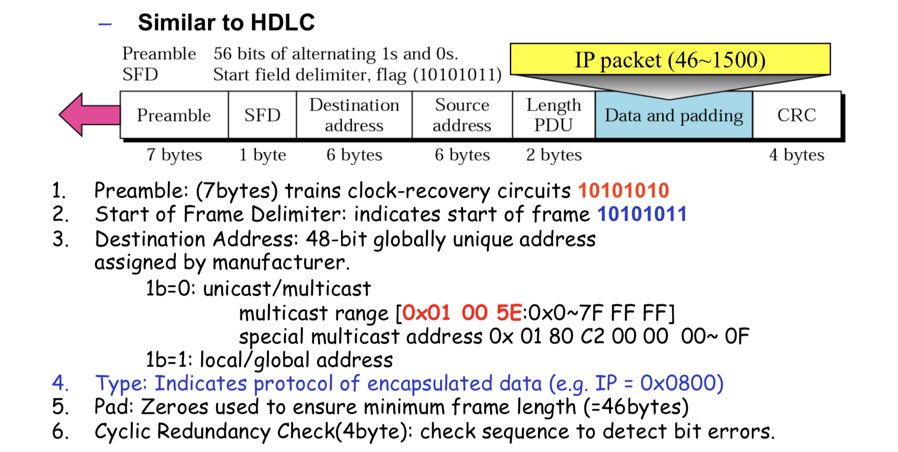

### ✔️ Error Detection

- **VRC** (Vertical Redundancy Check)
    - 7비트 + 1 패리티 비트로 구성 (ex. ASCII)
    - ex) 1110111**0** 1110111**0** 1110111**0** 1110110**1**
- **LRC** (Longitudinal Redundancy Check)
    - VRC에 마지막에 row parities로 구성된 바이트 추가 (BBC; block control character)
    - ex) 1100111**1** 1011101**1** 0111001**0** 0101001**1 01010101**
- **CRC** (Cyclic Redundancy Check)
    - 데이터를 어떤 divisor로 나눈 다음 그 나머지를 data 뒤에 붙여서 전송
    - Receiver측에서는 data + CRC를 같은 divisor로 나누어 나머지가 0인지 확인
    - CRC는 algebraic polynomial로 표현됨
    - CRC-16은 divisor가 17bits이며 HDLC에 사용
    - CRC-32은 divisor가 33bits이며 LAN에 사용

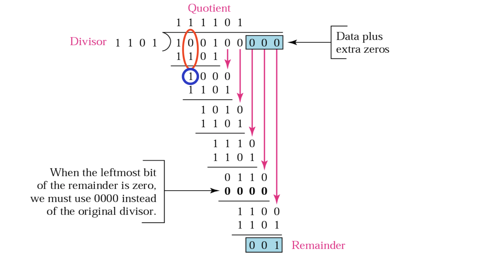

- **Checksum**
    - Sender가 1의 보수를 취해 전송하면 Receiver 측에서는 checksum을 포함한 모든 비트가 0이 되는지 확인

### ✔️ Error Correction (ARQ)

- ARQ: Automatic Repeat Request (자동 반복 요청)
- Stop-and-Wait ARQ
    - 한 번에 frame을 하나씩 보내는 방식 (Sliding Window 존재 X)
    - 💡 **Piggybacking**: sender와 receiver가 서로 데이터를 주고받는 경우라면 data frame에 ACK 정보를 함께 실어 보내는 method

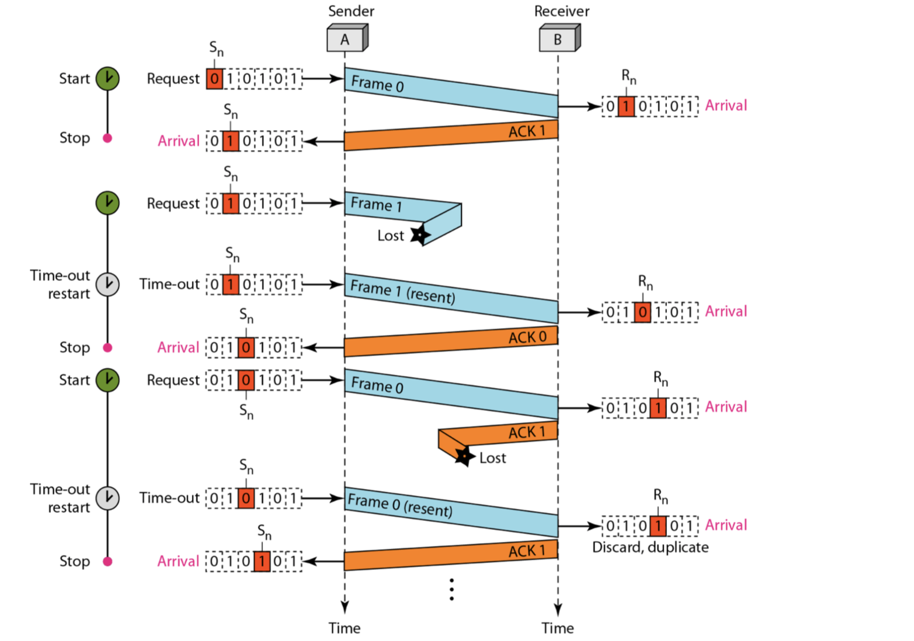

- **Go-Back-N ARQ**
    - 어떤 프레임 하나가 손상되거나 도착하지 않은 경우 ACK를 받은 마지막 frame부터 모든 프레임을 재전송

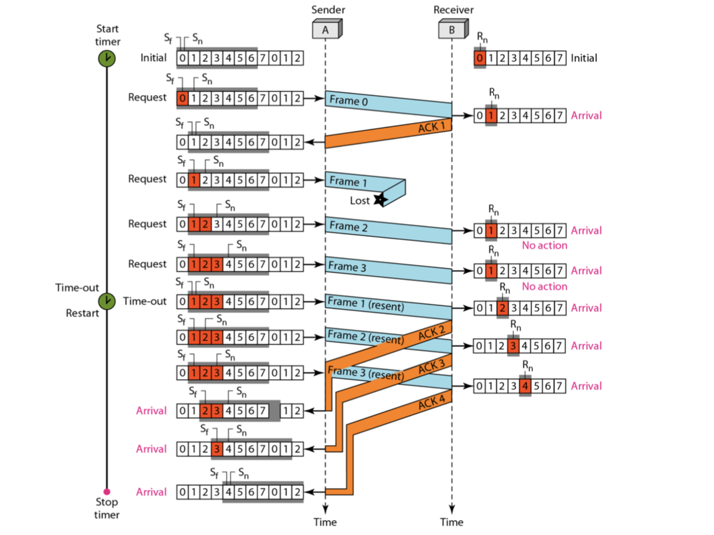

- **Selective Repeat ARQ**
    - 손상되거나 사라진 프레임만 재전송

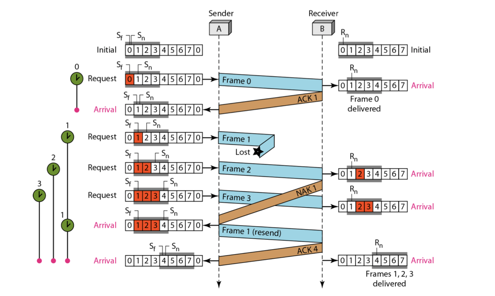

### ✔️ Media Access Control

- 여러 유저가 동시에 같은 채널을 사용하는 경우의 문제
    1. Fair among users
    2. High efficiency
    3. Low delay
    4. Fault tolerant
- Random Access Protocols
    - **CSMA (Carrier SenseMultiple Access)**
        - **Carrier Sensing:** 전송 전에 매체가 사용중인지 확인
        - ⚠️ 감지 타이밍에는 매체가 비어있어도 그 이후 프레임이 도착해 충돌할 수 있다: 전파지연(propagation delay)가 존재하기 때문
    - **CSMA/CD (Carrier SenseMultiple Access with Collision Detection)**
        - 유선 Ethernet에서 사용
        - Binary Back-off 알고리즘
            - 충돌 발견시마다 jamming signal 전송 후 K ← K + 1
            - (0 ~ 2K - 1사이의 랜덤한 수) * (maximum propagation time or average transmission time) 만큼 기다린다
    - **CSMA/CA (Carrier SenseMultiple Access with Collision Avoidance)**
        - 충돌 감지가 어려운 무선 네트워크에서 사용
        - 채널이 idle 상태라고 여겨져도 잠시 기다린 뒤 전송을 진행
- Controlled Access Protocols
    - **Reservation**
        - Frame이 mini-slot으로 쪼개져 전송할 데이터가 있으면 자신에게 할당된 slot에 데이터를 실어서 보내는 방법
    - **Polling**
        - Primary 스테이션이 존재. 데이터를 받을 준비가 되면 primary측에서 `POLL` signal을 보냄
        - Primary 스테이션에서 보낼 데이터가 있으면 `SEL` signal을 보냄: Selecting
    - **Token passing**
        - Ring 형태로 네트워크를 구성하고 token을 돌리는 방식

## 3️⃣ 네트워크 계층 (Network Layer)

### ✔️  Switching

- Circuit Switching
    - 전체 메시지가 쪼개지지 않은 채로 source에서 destination까지 전송됨
    - ex) 전화선
- **Packet Switching**
    - 메시지가 packet 단위로 쪼개져서 전송됨
    - Connectionless service
        - Forwarding decision을 destination address 기반으로 함
        - Routing table에 `destination address - output interface` 형태로 매핑
    - Connection-oriented service
        - Forwarding decision을 `label`로 함
        - Routing table에 `port - label` 형태로 매핑 (incoming / outgoing 따로)
        - → Setup와 teardown 존재, 일종의 **virtual circuit**을 만드는 개념

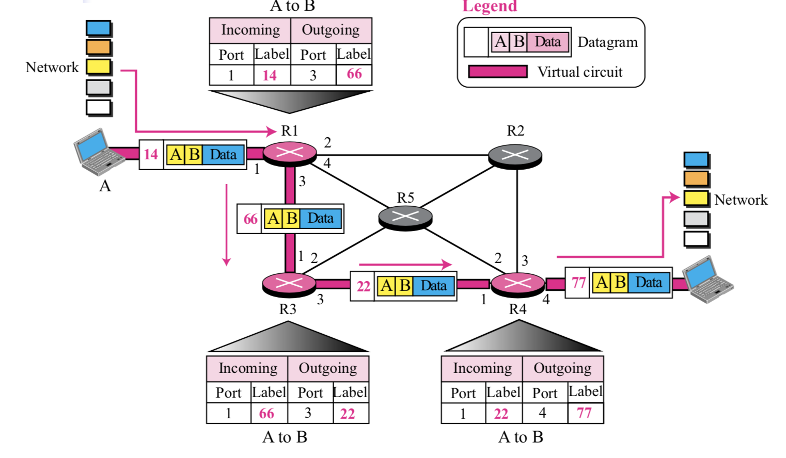

### ✔️ IP Address

- Classful addressing
    - Class A - 시작 바이트: 0, 주소: 0~127
    - Class B - 시작 바이트: 10, 주소: 128~191
    - Class C - 시작 바이트: 110, 주소: 192~223
    - Class D - 시작 바이트: 1110, 주소: 224~239 → Milticating
    - Class E - 시작 바이트: 1111, 주소: 240~255 → Reserved
- Subnetting
    - IP address AND Subnet Mask → Network address
    - ex) `141.14.72.24` AND `255.255.192.0` → `141.14.64.0`
- Classless addressing
    - Variable-length blocks
        - `x.y.z.t/n`
        - ex) 140.120.84.24/20 → 140.120.80.0/20
        - ⚠️ 2의 멱수로만 사용이 가능하다

### ✔️ IP

- IP 에서의 패킷은 datagram이라 불림
- 헤더는 20~60바이트의 크기임
- ⚠️ Checksum은 header에 대해서만 해줌 (데이터는 전송 계층에서 처리)

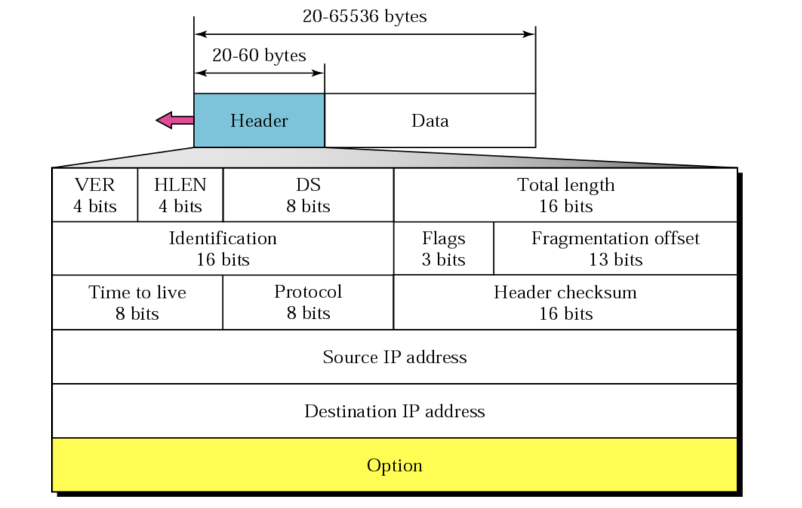

### ✔️ ARP (Address Resolution Protocol)

- Logical address를 물어보면 physical address를 알려주는 프로토콜
- IP 주소와 함께 사용되며, LAN 등에서 사용
- ARP request → broadcast
- ARP reply → unicast

## 4️⃣ 전송 계층 (Transport Layer)

### ✔️ UDP (User Datagram Protocol)

- 프로세스간 통신을 위해 포트를 제공
- 8바이트 헤더로 고정 (Source **port** number, Destination **port** number, total length, checksum 각각 2바이트씩)

### ✔️ TCP (Transmission Control Protocol)

- **Three-way handshaking**
    - SYN → SYN+ACK → ACK의 순서로 커넥션 수림
    - FIN → ACK → FIN → ACK의 순서로 커넥션 종료
    - 동시에 (simultaneous) 커넥션 수립 시 SYN / SYN → SYN+ACK / SYN+ACK 2번만에 수립 됨

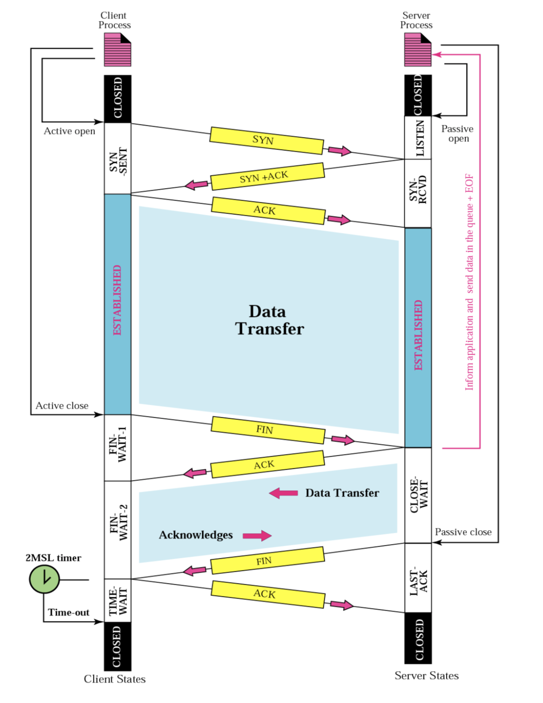

- **Flow Control**
    - 상대의 수신 버퍼 상황을 고려하여 보내는 패킷의 양을 조절하는 것
    - **Sliding Window**
        - 윈도우 크기 : `min(rwnd, cwnd)` rwnd=Receiver window, cwnd: congestion window

- **Error Control**
    - **ACK 전송 기준**
        1. Piggy back: 보낸 데이터가 있는 경우 데이터와 ACK를 함께 전송
        2. 보낼 데이터가 없는 경우 500ms time-out후에 ACK 전송
        3. Delayed ACK: 데이터가 많이 들어오면 timeout이 되지 않아도 ACK 전송
        4. 버퍼 중간에 gap이 생긴 경우 → 받은 제일 마지막 번호로 ACK 전송
        5. Filled: Gap이 다시 채워지면 ACK 전송
        6. 중복 데이터가 들어오면 ACK를 바로 전송

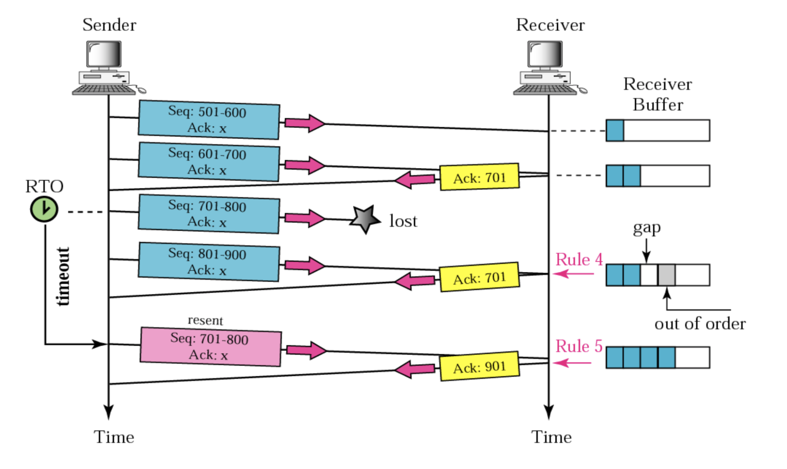

- **Congestion Control**
    - Slow Start: 천천히 시작해서 exponentially하게 증가함
    - Congestion Avoidance: 천천히 증가시키다가 congestion 발생시 줄여나감

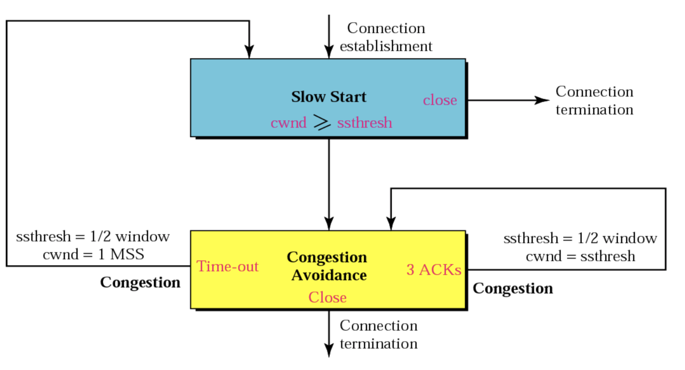

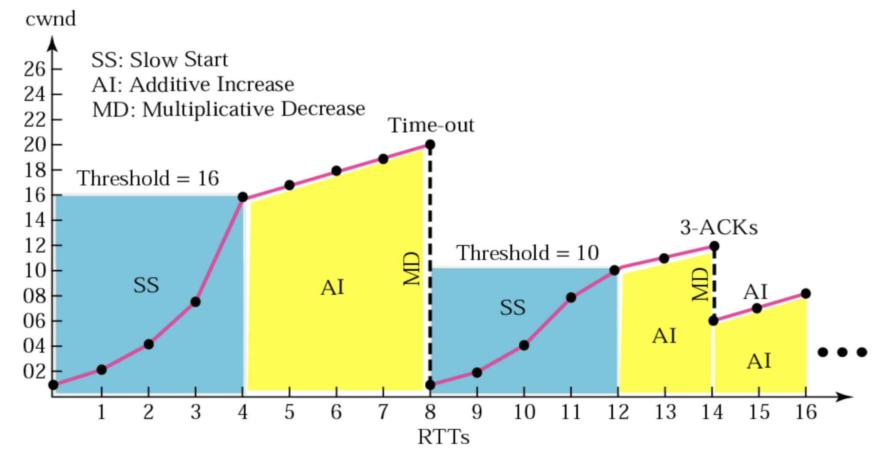

## 7️⃣ 응용 계층 (Application Layer)

### ✔️ 대표적인 응용 계층 프로토콜

- DNS: Domain Name Space
- FTP: File Transfer Protocol
    - passive open & active open
    - Control process와 data transfer process의 분리
- HTTP: Hyper Text Transfer Protocol

---

### **참고 자료**

- 한양대학교 데이터통신 수업 강의자료, 최진식 교수 (ITE3003)
    - 교재 - Data Communications and Networking 5/e, Behrouz A. Forouzan
- 한양대학교 컴퓨터네트워크 수업 강의자료, 조인휘 교수 (ENE4019)
    - 교재 - TCP/IP Protocol Suite 4e, B.A. Forouzan
